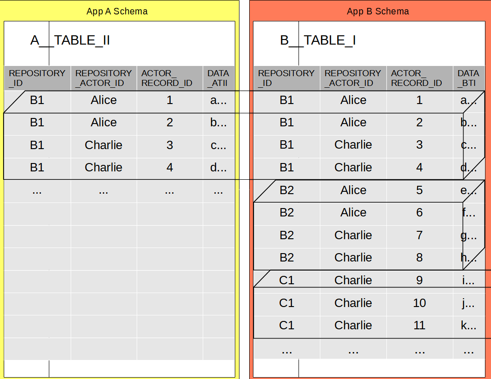
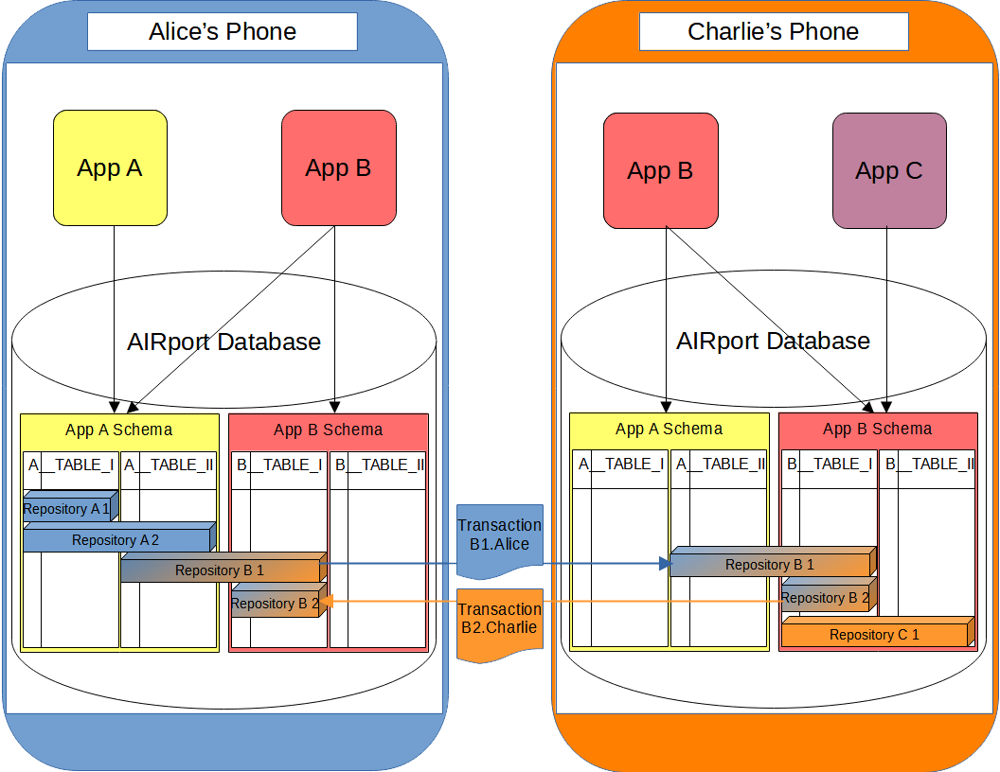
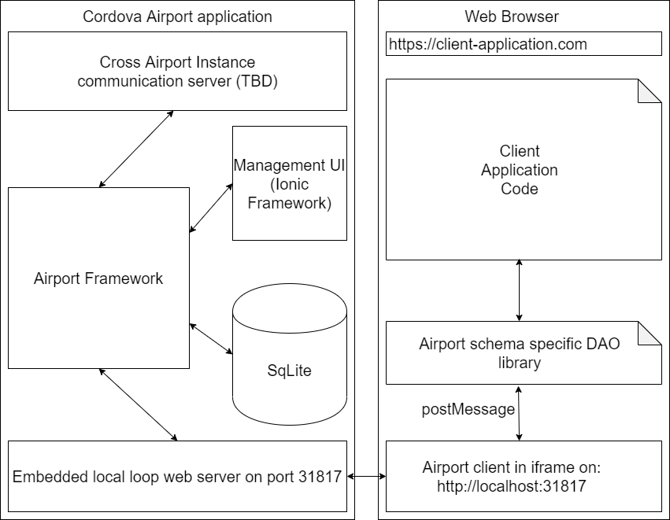
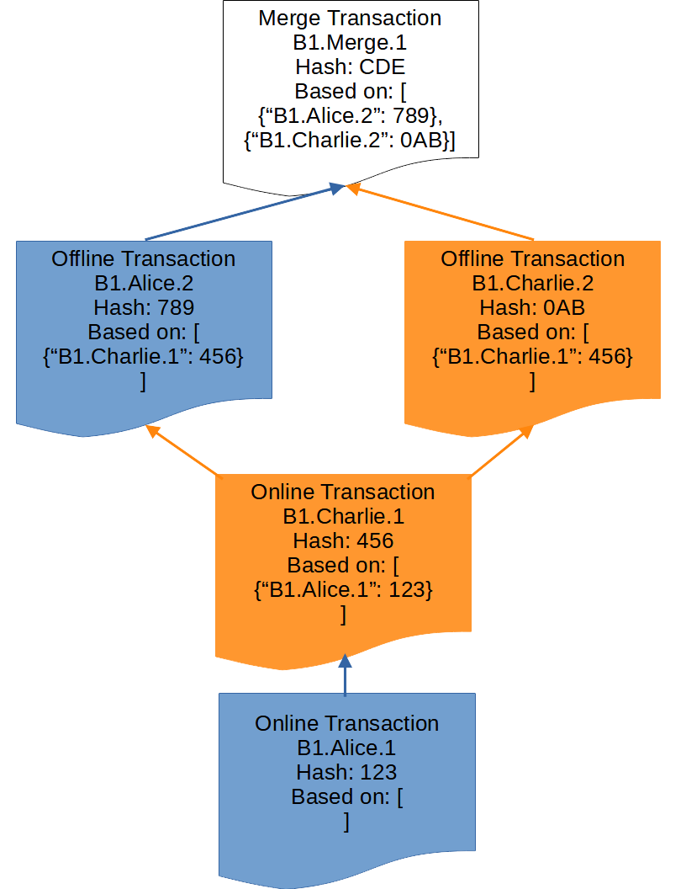

# Open Grant Proposal: `Autonomous Interdependent Repositories - Basic Functionality Prototype`

**Name of Project:** Autonomous Interdependent Repositories

**Proposal Category:** `devtools-libraries`

**Proposer:** [artem-v-shamsutdinov](https://www.linkedin.com/in/artem-shamsutdinov-1b5910/)

**Do you agree to open source all work you do on behalf of this RFP and dual-license under MIT and APACHE2 licenses?:** Yes

* [Project Description](#description)
* [Value](#value)
  * [The benefits to getting this right](#benefits)
  * [The risks](#risks)
* [Economics](#economics)
  * [Monetization](#monetization)
    * [Decentralized advertisement with profit sharing](#advertisement)
    * [Fee model](#fee-model)
* [Deliverables](#deliverables)
* [Development Roadmap](#roadmap)
* [Maintenance and Upgrade Plans](#maintenance)
* [Team](#team)
* [Additional Information](#additional-info)


# Project Description<a name="description"></a>

- The problem: 

Distributed Applications (DApps) lack an easy-to-use database layer.

The new DApps are gaining more functionality, getting more complex and 
currently the number of applications devs is limited due to a steep 
learning curve.   For the majority of Software Engineers (who are used 
to working with relational databases) it is hard to write applications 
with complex data schemas.

- Our solution:

AIRport is a reference implementation of
[Autonomous Interdependent Repositories](https://patents.google.com/patent/US10902016B2).

AIRport is a decentralized relational database of Repositories.  Repositories
are virtual databases, each with its own transaction log.  Each Repository has
a globally unique identifier that allows to distinguish it from other
repositories in the same relational database (such as WebSql, or SqLite in
a Cordova based App). For two Users to share a Repository it must be present
on their devices, and the schemas used by that repository must be installed
in AIRport databases on those devices.

    For example, in the below diagram AIRport database contains 2 schemas,
    one from App A and one from App B.  App A Schema contains table A__TABLE_II
    and App B Schema contains table B__TABLE_I.  3 repositories are pictured.
    Repository B1 spans both tables (and thus both schemas).  Repository B2
    is fully contained in B__TABLE_I.  Repository C1 spans only tables in App
    B Schema (other tables are not pictured).



Records in AIRport tables are always identified by 3 columns:
* REPOSITORY_ID - this column contains the Repository's unique identifier
* REPOSITORY_ACTOR_ID - The id of an "Actor" that created or modified the record
* ACTOR_RECORD_ID - The id of the record (unique to combination of Repository and Actor)

Combination of these Ids allows for globally unique record identifiers within AIRport
tables.  It also allows to quickly find all records for a given repository or for
a given Repository Actor.  In practice, REPOSITORY_ACTOR_ID may also be unique while
ACTOR_RECORD_ID will be unique to the device it was created on and may repeat in a
given table because records may be created on different devices.

Each device/phone contains a single AIRport database that is shared by all
applications on that device.  The composition of the applications on each
device can be different.  The composition of the schemas installed in each
AIRport database on each device can be different as well.  Each database
contains only the Repositories the user of that device decides to keep on it.



## Value<a name="value"></a>

Our target users are developers for Distributed Applications.  AIRport allows
multiple applications to share the same schemas.  It also allows to 
independently track data as Repositories.  A Repository is a virtual database
tracked in a number of tables across any number of schemas.  At a high level,
it's a "virtual interface" between applications and schemas.

This:

* Allows the Application End Users to seamlessly share the data only with 
  selected Users.
* Lowers the barrier to entry for new Apps as they can reuse existing schemas 
  or write add-on functionality to existing Apps.
* Lowers the barrier to entry by providing exiting data to new Apps.
* Allows hybrid applications where part of the data is centralized (for 
  large scale sharing) and part is in private Repositories.
  
<pre>
    For example, in an Event Tracking App, data for each event is a separate Repository.
    Other Applications can build upon this App's schema, provide additional schemas 
    for functionality that builds upon the first App.  So, another App can build
    a Event Chat System for participants and use both the Event Tracking App schema
    as well as it's own schema.  Yet another App can build in Event Voting and use
    the schemas for both core Event Tracking and Event Chat and provide it's own
    schema as well.  Even more Apps can built add-on functionality without providing
    their own schemas.  The data used by all of these Apps (across all related 
    schemas) is stored in Event specific Repositories, one repository per event.  Thus
    a repository spans multiple Event Apps and Schemas.  The aggregate of specialized
    Event Apps together provides better functionality than the sum of its part Apps.
    Therefore, AIRport enables synergies between Apps where "the whole is greater than
    the sum its parts", reducing the overall costs (and the costs of building each App).
</pre>

- The benefits to getting this right<a name="benefits"></a>

Each repository is completely autonomous and can be added to a host relational
database and/or removed from it, at any time, without affecting other
repositories.  Repositories can have references to each other thus depending
on data that other repository contains, but must be usable without referenced
repositories (thus being both interdependent and autonomous).

AIRport Repositories have blockchain based transaction log storage to enable
communication between devices.

AIRport offers refined, high productivity developer APIS:
  
* Simplified JPA annotations (no session concept, easier relations)
* GraphQL like query API
* GraphQL/Firebase like hybrid solution for mutation & access rules
* Automatic schema generation and installation

AIRport is fully functional off-line, commits are made locally and are added
to the "longest chain" once device is back on-line.

- The risks:<a name="risks"></a>

Project is completely thought out and largely coded with a granted patent, risks of 
getting it wrong mostly relate to it being "developed in a vacuum".  In order to
ensure that AIRport does not diverge from requirements of real applications we
are developing a seed application - Votecube.  Votecube has a complex relational
schema and various persistence and validation needs.

The seed project is completely thought out and its most complex part is coded,
  the need for automatic reviews of articles based on multiple dimensions is
clear and present (there are already working solutions out there with manual
reviews from multiple points of view, we are now just taking it to the next
level with automatic, and thus large scale, processing 3D interfaces, and
aggregate analysis).  The more basic break down interface will be based on the
same (already thought out and implemented schemas) and will also be based on
existing UI implementation (will add a simpler 3D axis based UI).

For example: 

```
X-axis: Liberal - Conservative
Y-axis: Left Wing - Right Wing
Z-axis: Traditional - Progressive
```

The key risk is in figuring out how to monetize on the platform.
To solve this we'll be building a decentralized Advertisement Engine.
Being decentralized it will allow full decentralized applications to be
built on top of AIRport.  Without it Apps will have to rely on centralized
advertisement platforms for their revenue.  It also makes long term success
of the project possible, providing revenue to the AIRport team for bug fixes
and improvements.

We have the experience to get the decentralized Advertisement Engine done:

* High definition model - [Nik Dobrinov](https://www.linkedin.com/in/nikolaydobrinov/) on
* AI and tensor models - [Andrei Belitski](https://www.linkedin.com/in/dr-andrei-belitski-178b3a75/)
  
## Economics<a name="economics"></a>

In order for AIRport to be successful all of the involved parties need to be
incentivized to use it.  The three primary party types are:
- App Users
- App Creators
- AIRport Team

Users are generally interested in keeping their data private.  They are also
interested in reducing data duplication and duplicate data entry.  Users may
also be incentivized by profit sharing schemes from both App Creators and
AIRport Team.

App creators are incentivized by the profits that applications generate.  They
are also incentivized  in acquiring large market share (to maximize profits)
by enhancing and enlarging their offerings but are dis-incentivized by the costs
of additional work and expansion.

AIRport team incentives align closely with those application creators.  They
have an additional incentive to attract application creators to write Apps
on the platform.

Airport naturally fulfils User data incentives though it's technology.  It
also naturally solves the dilemma of large App monopolies by
 promoting App specialization (via schema+data sharing).

### Monetization<a name="monetization"></a>

A profit sharing setup will be used to reward schema creators when Apps
use them.  A nano-payment will be made the schema creator every time a CRUD
operation is performed (by Apps that do not directly associate with that schema).
Eventually the same logic will apply for BPMN logic providers.

To fulfil the rest of the incentives two alternative mechanisms will be
employed:

#### Decentralized advertisement with profit sharing<a name="advertisement"></a>

Airport (in combination with Arweave) will support a privacy-centric
advertisement engine.  The Ad decision making engine will kept on user devices,
thus solving data privacy issues.  Data will not be shared with any authority
or intermediary or the advertisers and will remain solely on the Users device
(inside the relational database, which is embedded in the locally installed
AIRport App).  This keeps the User in full control of how much data
is used for serving Ads.

The AIRport advertisement model is flipped from traditional push to pull.
In the push model a central authority decides what Ads get pushed to a user.
In AIRport pull model the User device decides what Ads to pull to the User.
Ads themselves will be stored on Arweave and tagged to allow pulling
the most appropriate Ads.  Thus the advertisement platform becomes fully 
decentralized and cannot be manipulated by a central authority.

In the long term multiple incentive tiers will be employed for the Users,
with increasing monetary rewards for all participants (because they provide
increasingly accurate Ad placement):

1.  Basic "content based" tier - users receive Ads based on the data that is
(locally) sent to the Apps from AIRport (for any given rendered page).
2.  Enhanced "content based" tier - Apps reinforces Ad choices by
sending back to AIRport page metadata (and static content rendered on pages).
3.  Demographic tier - user voluntarily stores their demographic data in
AIRport.  Again, it's not shared with anyone, just used to pull more accurate
Ads.
4.  Geographic tier - users opt in to using their permanent and current
location for serving Ads (again this information remains on the device
only and is not shared with anyone).
5.  Model tier - users opt in   anonymized Big Data model generation for
optimal Ad placement.  This does require sharing data which is scrubbed
of any PI (AIRport will provide annotations on per column basis to flag 
PI data).

Advertisement revenue will be split between the 3 parties (User, Apps,
Airport) in a manner that best fits the market conditions at that time.

#### Fee model<a name="fee-model"></a>
Users can opt out (either wholesale, or per App, or per time period,
or per repository) of advertisements by paying for usage of AIRport and
applications.  This allows the Apps and AIRport to still fulfill their
monetary incentives.  AIRport can act as either a central fee platform,
where it shares User fee revenue with the Apps, or Apps can share
their revenue with AIRport.

The expectation is that only a small number of Users will op-in for
the fee model and that the bulk of funds will come from the
decentralized advertisement engine.

## Deliverables<a name="deliverables"></a>

- [Artem Shamsutdinov](https://www.linkedin.com/in/artem-shamsutdinov-1b5910/)

A relation database central to the device (which it is running on) with a
localhost-only web API for native and web applications (as well as a 
web-only trial version of the application).
  
Shared virtual repositories (via independent transaction logs) based on IPFS DAG.

- [Nikolay Dobrinov](https://www.linkedin.com/in/nikolaydobrinov/)

A centralized (high precision) advertisement model based on anonymous user data.

- [Andrei Belitski](https://www.linkedin.com/in/dr-andrei-belitski-178b3a75/)

A local tensor based (or newer tech if available) advertisement engine.

- [Brian Gill](https://www.linkedin.com/in/brian-gill-1353b21/)

A seed application source: Full implementation of the seed project
[Votecube](https://github.com/votecube) 
([Prototype](https://votecube.com/#!/poll/info/Cube/vote/kBSVLFHn01lMtvPXYIzu/4vz9cPyZiMoaGG4JOh6t))).
AIRport documentation.

## Development Roadmap<a name="roadmap"></a>

### Phase 1: Basic Functionality Prototype<a name="phase-1"></a>

1. Month 1 - Core Framework
  * Finish Non-Sharing core framework code (Observables disabled, basic schema generation, no indexes) - 3 weeks
  * Debug core framework - 1 week
2. Month 2 - Basic Internal Functionality
  * Finish basic repository creation & maintenance - 1 week
  * Finish basic (semi-centralized) notification network - 2 weeks
  * Debug and test all basic internal pieces to gether - 1 week
3. Month 3 - Conflict Resolutiona and test Apps
  * Finish Basic Automated conflict resolution (timestamp based) - 1 week
  * Write basic chat App - 1 week
  * Write basic todo list App - 1 week
  * Integration test applications with sharing - 1 weeks
4. Month 4 - Blockchain
  * Write basic private blockchain implentation - 3 weeks
  * Debug and integration test data blockchain protection - 1 week
5. Month 5 - IPFS integration
  * IPFS integration with Javascript Client (for long term persistance) - 3 weeks
  * Integration test with IPFS - 1 week


Functionality:
        
        Basic Functionality Prototype
    
People:
      
        1 person - Artem Shamsutdinov (framework developer)
  
Required organizational finding:

1. Month 1 - Core Framework

        $10000 ($9000 Salary + Benefits, $1000 Operational Overhead)

2. Month 2 - Basic Internal Functionality

        $10000 ($9000 Salary + Benefits, $1000 Operational Overhead)

3. Month 3 - Conflict Resolutiona and test Apps

        $10000 ($9000 Salary + Benefits, $1000 Operational Overhead)

4. Month 4 - Blockchain

        $10000 ($9000 Salary + Benefits, $1000 Operational Overhead)

5. Month 5 - IPFS integration

        $10000 ($9000 Salary + Benefits, $1000 Operational Overhead)

Total:        $50000


- Phase 1 timeframe
    * Project start date September 1st 2021
    * Project completion date February 1st 2022
    
    Total time: 5 months

- Phase 1 Budget

<pre>
    * Salary + Benefits
        Artem Shamsutdinov:                $45000
    * Operational Overhead:                $5000

    * Total cost:                          $50000
</pre>


## Maintenance and Upgrade Plans<a name="maintenance"></a>

This proposal builds a minimal functionality prototope.  Subsequent proposals will be submitted for:

* Mobile device integration (Go + V8 + SqLite)
* Peer-to-peer notification network
* Peer-to-peer node registration network
* Repository joining and permissions maintenance
* Observable data (local to device)
* Fast notification mechanisms
* Schema versioning
* Advertisement engine
* (Global) repository search functionality

These will have to be completed in the following phases.

# Team<a name="team"></a>

## Team Members

- Artem Shamsutdinov
- Nikolay Dobrinov
- Andrei Belitski
- Brian Gill

## Team Member LinkedIn Profiles

- https://www.linkedin.com/in/artem-shamsutdinov-1b5910/
- https://www.linkedin.com/in/nikolaydobrinov/
- https://www.linkedin.com/in/dr-andrei-belitski-178b3a75/
- https://www.linkedin.com/in/brian-gill-1353b21/

## Team Website

[https://dataindependence.net](https://dataindependence.net)

## Relevant Experience

Dr. Nikolay Dobrinov - extensive experience in statistical model research 
and implementation

Dr. Andrei Belitski - extensive experience in AI, neural networks research 
and implementation

Brian Gill - overwhelming experience in application development

Artem Shamsutdinov - inventor of the technology and implementor of the
core framework

## Team code repositories

https://github.com/autonomous-interdependent-repositories

https://github.com/votecube

# Additional Information<a name="additional-info"></a>

1. AIRport framework greatly aids development acceleration of distributed
   applications.

The process of installing AIRport is:

*  User navigates to a consumer Application that uses AIRport and creates
   a Repository
*  Application prompts the user to install AIRport database App (if not
   installed already)
*  User installs AIRport App
*  The consumer application creates the private Repository and prompts 
   to add other participating users
*  Creating user shares the Repository, and the App notifies new users



AIRport Repositories have blockchain based transaction log storage to enable
communication between devices. AIRport is fully functional off-line, commits
are made locally and are added to the "longest chain" once device is back on-line.
Each Repository transaction log is a separate chain and itself can consist of
sub-chains if devices go out of sync. Thus, the Repository transaction log is a
Directed Acyclic Graph with each commit being a separate block and all
sub-chains are resolved to the "longest chain" via timestamp based conflict
resolution mechanism.

    For examle if Alice modifies record 1 while being offline and Charlie
    modifies the same record also offline but at a later time then both
    with be notified of the conflict and automatic conflict resolution
    will pick the latest column values while allowing for manual confict
    resolution.



Based on my current limited understanding of blockchains:

A Repository chain can be integrated with IPFS since it supports DAG
datastructure and is storage centric.  Integrations with other chains 
are possible: A Repository chain can be tied to the chains of the
individual chains of creators/participators in the Repository.  In
turn, those can be integrated into any 3.0 blockchain.

Core to AIRport is the idea is for multiple applications to collaborate 
and re-use data.  The two key points here are:

* User is in control of their data they allow applications to access 
  their data (usually only a part of their data).
* Applications are in control of sharing schemas with other applications 
- they can allow or deny access to their schemas.

This the applications only interact with the device-local database, making AIRport
fully operational in offline-mode.  The database is in charge of maintaining the
repositories contained in it.  It may occasionally prompt the user to purge
infrequently used repositories (or may do so automatically if not configured),
leaving them only in the cloud backup.  The applications however may request the
user to load additional repositories from the cloud, for processing.

AIRport aims to provide zero code deployments where a thin shim is provided
for the framework and TypeScript interfaces are used to define the
query+mutation API against the schemas used by the application.  The rest
is defined in the schema configuration file, which is loaded into the
device's AIRport database directly.  The config file is generated from
the annotated Entities and the DAO code, which itself relies on
auto-generated TIQL (Typescript Instrumented Query Language ) objects
and interfaces as well as core framework code and generated Base DAO objects.

2. The time for Votecube decentralized decision-making system is at hand:

Existing businesses are doing manual reviews of articles from multiple points
of view (centrist, left and right).  We have the experience to do better 
with automated processing of a much larger number of articles and 
statistical analysis on the aggregate information.  A new 3-Dimensional UI 
in the Votecube project will display 3 dimensional positional graph for each
article and for all articles in on the topic.  Dimensions could be many, but
we'll be showing the ones most relevant for the topic (as determined by AI
algorithms and per article automated statistical analysis).  For example for
political articles the dimensions could be:

X:  Liberal - Conservative
Y:  Left - Right
Z:  Traditional - Progressive

Each individual article will be automatically evaluated for its position 
on these axes, and a graph will be presented for this article.  An additional
aggregate 3-D graph across all evaluated articles on the issue will present
the overall picture of the public opinion.

The new UI will allow users to add their input on the article in terms of 
providing their own position of the article's position on the selected axis
and allow adding comments on a forum.

Then based on distilled information from each article the "contrast cube" will 
be constructed. This aggregate cube will be based on the dimensions with 
the "strongest" ratings and will allow easy user voting on the topic.
