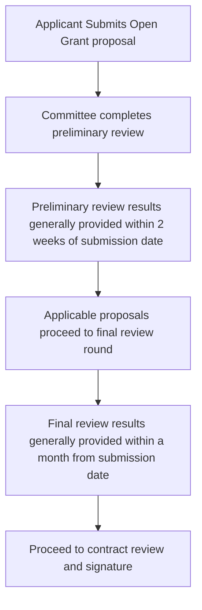

# Open Grants

## About
Do you have an idea for pushing the Filecoin ecosystem forward? Open grants are intended to support novel ideas that advance the Filecoin ecosystem, bring significant new usage, or directly advance the Filecoin mission statement. 

Open Grants applications for funding up to $50,000 are welcome in the following categories:

- **Developer and Data Tooling**: For projects that close important experience gaps for developers or large dataset users. This might include improvements to command line or visual UX, API improvements, data preparation and ingest tools, developer tools and infrastructure, and more.
  
- **Integrations**: For projects that add integration or support for Filecoin into popular, or fast-growing, existing tools and developer communities in Web2 or Web3. 

- **Research & protocols**: For projects aimed at improving the foundations of Filecoin.

- **Storage**: For research and development of scalable solutions in storage markets including improved data onboarding tools.

- **Retrieval**: For projects focused on retrieval solutions for Filecoin. Such as tools that optimize retrieval services, and enhance user experiences in the wider retrieval ecosystem.

- **FVM**: Projects may include rollups, improvements to core functionality, and integrations of Filecoin with both new and existing tools or protocols.

Note: The Devgrants program will prioritize funding that enhances functionality for Filecoin Network while de-emphasizing funding for projects that are exclusively IPFS, libp2p, and other stacks we may have previously supported. Look out for opportunities to apply for IPFS-focused grants at [ipfs/devgrants](https://github.com/ipfs/devgrants).

## How to apply and review timeline
                                    
To submit an Open Grant proposal, [create a new issue](https://github.com/filecoin-project/devgrants/issues/new?assignees=smagdali%2C+ErinOCon%2C+realChainLife&labels=Open+Grant&projects=&template=open-grant-appolication.md&title=) using the Open Grants Proposal template. After you submit your proposal, you can expect the following to occur:

- We review grant proposals continuously. During review, we may add comments, questions, or change requests on your team's submission. Please look for comments on your Github issue.
- We aim to provide applicants of a preliminary review update within two weeks of the proposal submission date. A final decision will generally be given within 4 weeks from the submission date.
- If your proposal is accepted, we will ask you to review and sign our Open Source Software Grant Agreement, which will include a copy of the work plan and funding milestones. ***NO WORK SHOULD BEGIN UNTIL CONTRACT IS SIGNED BY BOTH PARTIES.***

## Process Overview

                                               
Grants should not be treated as final, or the funding as fully approved, until the Grant Agreement is signed by both parties. NO WORK SHOULD BEGIN UNTIL CONTRACT IS SIGNED BY BOTH PARTIES.

Please reach out to #grants-help on Filecoin Slack or email grants@fil.org with any questions.

