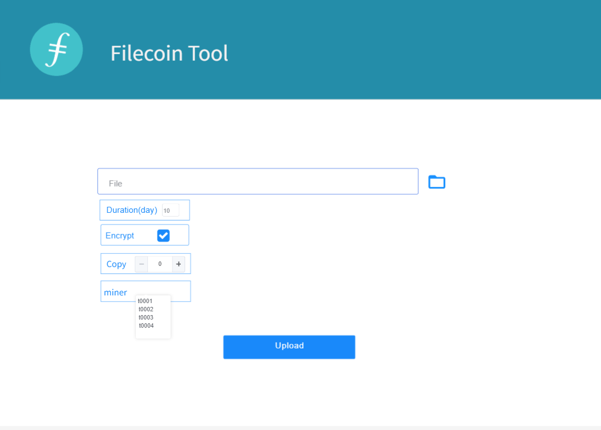
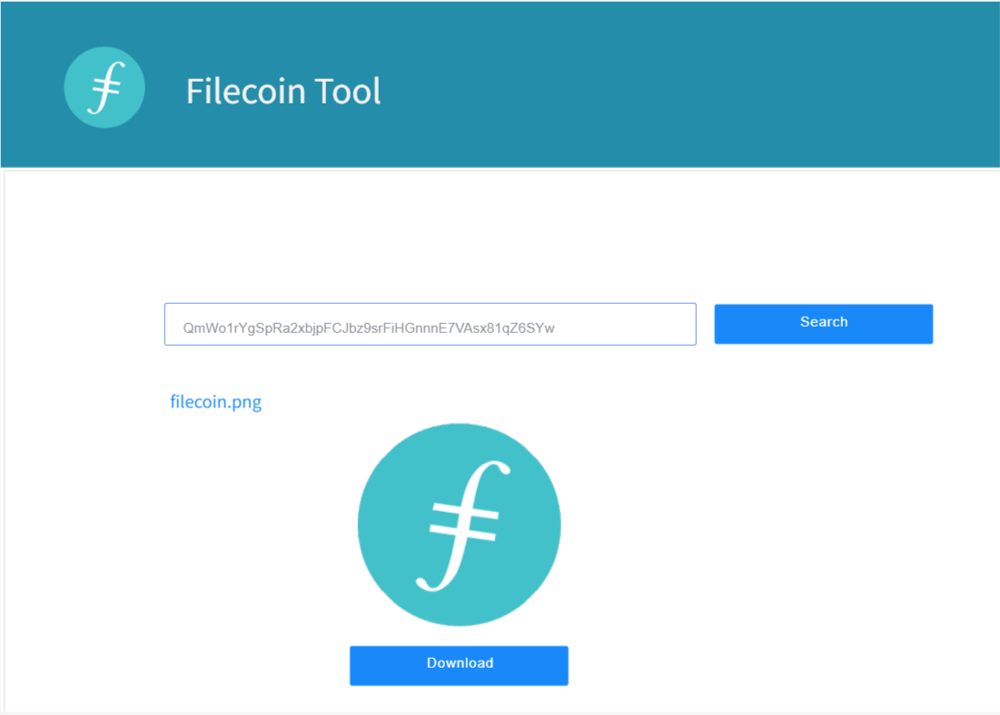

 # RFP: `Filecoin file storage and retrieval utility`

 **Name of Project:**   Filecoin file storage and retrieval utility
 
 **RFP Category:** app-dev
 
 **Proposer:** @IPFS-grandhelmsman
 
 **Do you agree to open source all work you do on behalf of this RFP and dual-license under MIT and APACHE2 licenses?:** Yes
  
 # Project Description
Filecoin file storage and retrieval application tool is an application tool based on the combination of filecoin incentive layer and IPFs distributed file storage system. The storage demander selects the miners in the filecoin list through the web client, and stores additional services (such as number of copies, encryption service, CDN acceleration service, etc.) according to the needs of customers, and pays a certain fil currency for file storage. 
Search files are browsed and downloaded through the set gateway. For example, picture files can be browsed directly through the web, and other files can be downloaded. 
The SDK layer encapsulates basic functions such as upload, fragment, breakpoint continue, download, encryption, copy, etc. it supports SDK layers of various languages, such as go, Java, etc. 
 
SDK Interface Description:
- The SDK splits the files on the client side and supports the function of point continuation.
- File encryption is performed by the corresponding encryption protocol. The stored file is the encrypted file. Downloading is performed by the corresponding decryption protocol to decrypt and download the file.
- The file copy can distribute the whole network according to the hot data and cold data, which can not only ensure the data security of the whole network, but also accelerate the CDN.
 
This tool is to quickly understand the decentralized application tools of filecoin in distributed storage system, which can help developers reduce their deep understanding of the huge system of filecoin and build their own application software 

## Deliverables
- 1.A web application tool, full-featured file upload (support breakpoint continuation), file retrieval, file encryption, etc.
- -File upload, support breakpoint renewal;
- -File encryption;
- -Multiple copies;
- -Global hot data, improve access speed;
- 2.Well documented code base;
- 3.Update user oriented documents with SDK or API interface;
- 4.This open source repository is dual licensed under license-mit and license-apache.

## Detailed Requirements & Constraints

### Data to Display
- 1.For file upload, you can choose encryption, number of copies, etc. 

- 2.Search content hash, picture file can be directly browsed by web, others can be directly downloaded; 

## Milestones & Funding
**Total Funding Amount:** 8500$ 
| Milestone No | Milestone description | capital | Estimated time | 
| :-----: | :-----: | :-----: | :-----: |
| 1 | High fidelity design model, running staging site with some UI elements | 2500$ | 2 weeks |
| 2 | The realization of file storage and retrieval | 4000$ | 8 weeks |
| 3 | All project deliverables have been completed and added to the filecoin shipyard (website, documentation, codebase) | 2000$ | 3 weeks |

## Maintain plan
1. Continuously update the code and keep it consistent with the filecoin interface; 
2. Constantly improve their own functions and user needs; 
3. Keep SDK or API updated in time; 

## Recommended Team
- ZHOU Shuyue : Filecoin Engineer and Researcher
- Chen Zhijie : FullStack Developver
- Huang tiefeng: WEB Engineer
- XU Gongpu：Android Developer
- YUE Manling: UI Designer
## Team Member Github Profiles
- [https://github.com/chenzhi201901](https://github.com/chenzhi201901) (personal)
- [https://github.com/free1139](https://github.com/free1139) (personal)
- [https://github.com/IPFS-grandhelmsman](https://github.com/IPFS-grandhelmsman) (team)
## Team Website
@IPFS-grandhelmsman 
http://www.grandhelmsman.com/cn/index.html 
## Relevant Experience
Helmsman is a team dedicated to IPFS and Web3.0. We have been actively involved in the construction of distributed storage ecosystem, and as a miner, we actively participated in the storage function test of filecoin Test stage, invested a lot of equipment for testing, and saved a lot of effective data. At the same time, in the previous official first round trusted settings of filecoin, participate in the test of large storage performance. Our team has accumulated rich knowledge and experience (blockchain experience of Ethereum and Bitcoin) on the blockchain at the same time.
## Team code repositories
[https://github.com/IPFS-grandhelmsman/sarah-client ](https://github.com/IPFS-grandhelmsman/sarah-client )  
[https://github.com/IPFS-grandhelmsman/sarah-console](https://github.com/IPFS-grandhelmsman/sarah-console) 
## Additional Information
In pursuit of excellence, we are committed to becoming the leading distributed decentralized storage device and technology service provider in the industry, improving the level of information storage, communication and propagation for all human beings. 
We have professional operation and maintenance capabilities of large-scale hardware equipment, and many years of experience rooted in the blockchain industry. We believe that we can better complete the blockchain explorer.
