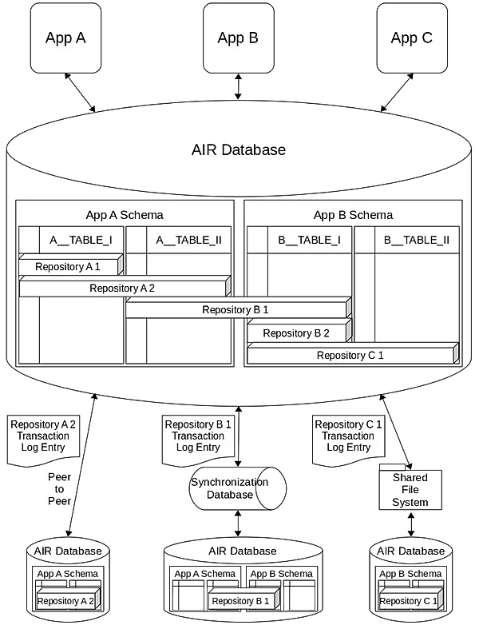

# Open Grant Proposal: `Autonomous Interdependent Repositories`

**Name of Project:** Autonomous Interdependent Repositories

**Proposal Category:** `devtools-libraries`

**Proposer:** [artem-v-shamsutdinov](https://www.linkedin.com/in/artem-shamsutdinov-1b5910/)

**Do you agree to open source all work you do on behalf of this RFP and dual-license under MIT and APACHE2 licenses?:** Yes

# Project Description

- The problem:
  
Distributed Applications lack an easy-to-use database layer.

- Our solution:

AIRport is a reference implementation of [Autonomous Interdependent Repositories](https://patents.google.com/patent/US10902016B2).

Provides a net-like relational database of repositories.  A repository is a virtual database with it's own transaction log.
It has globally unique identifier that helps to distinguish it from other repositories in the same relational
database (such as WebSql, or SqLite in a Cordova based App).

## Value

- The benefits to getting this right

Each repository is completely autonomous and can be added to a host relational database and/or removed from it,
at any time, without affecting other repositories.  Repositories can have references to each other thus depending
on data that other repository contains, but must be usable without referenced repositories (thus being
both interdependent and autonomous).

Initial AIRport deployments will have server components to enable communication between mobile devices.
In it's final form AIRport could be used directly between devices to communicate
changes in the state of repositories shared between their members (based on some form of
[mobile device-to-device Web Access](https://patents.google.com/patent/WO2019036410A1)).

- The risks:

Project is completely thought out and largely coded with a granted patent, risks of getting it wrong
  are minimal.

The seed project is competely thought out and its most complex part is coded,
  the need for automatic reviews of articles based on multiple dimentions is
clear and present (there are already working solutions out there with manual reviews from
multiple points of view, we are now just taking it to the next level with automatic,
and thus large scale, processing 3D interfaces, and aggregate analysis).  The more basic break down
interface will be based on the same (already thought out and implemented schemas)
and will also be based on existing UI implementation (will add a simpler 3D axis
based UI. for example X: Liberal - Conservative, Y: Left - Right, Z: Traditional - Progressive.

The key risk is in figuring out how to monetize on the platform.
  Our current thinking is building a distributed advertisement engine that
  will solve the problem of big organizations retaining user data to provide
  relevant ads.  This should be doable with a combination of personsalized tensor
  based model and a anonomized data collection for a group of centralized models.
  The monetization is the difficult part of the project, we have the experience
  to get it done [Nik Dobrinov](https://www.linkedin.com/in/nikolaydobrinov/) on
  central modeling and [Andrei Belitski](https://www.linkedin.com/in/dr-andrei-belitski-178b3a75/)
  on AI but we are presently not sure exactly how we'll make data anonymous
  for central model building (initial thought is to one way hash all of PI).

## Deliverables

- Artem Shamsutdinov

A relation database central to the device (which it is running on) with a localhost-only
web API for native and web applications (as well as a web-only trial version of the application).
  
Best in breed, high productivity developer APIS:
  
* Simplified JPA annotations (no session concept, easier relations)
* GraphQL like query API
* GraphQL/Firebase like hybrid solution for mutation & access rules.  
  
Shared virtual repositories (via independent transaction logs) based on IPFS DAG.

- Nikolay Dobrinov

A centralized (high precision) advertizement model based on anonymous user data.

- Andrei Belitski

A local tensor based (or newer tech if available) advertisement engine.

- [Brian Gill](https://www.linkedin.com/in/brian-gill-1353b21/)

A seed application source: [Votecube](https://github.com/votecube), partial prototype: [votecube.com](https://votecube.com/#!/poll/info/Cube/vote/kBSVLFHn01lMtvPXYIzu/4vz9cPyZiMoaGG4JOh6t)
with a complex relational schema and a forward thinking opinion gathering
engine & UI.

## Development Roadmap

- Artem Shamsutdinov
    
    * Functionality:
        
        Final working framework
    
    * People:
      
        1 person - framework developer
  
    * Required organizational finding (salary/org expenses/taxes/cryto converson tax/fees):
      
        $150000
  
    * Timeline
    
        1. Finish core framework - 6 month
  
        2. Finish device integration - 1 month
  
        3.  Integrate with IPFS DAG - 1 month
  
        4.  Integration test framework/device/DAG combination - 1 month  
  
        5.  Integrate local tensor model - 1 month
        
        6.  Integrate centralized ad models - 1 month  
        
        7.  Integration test complete solution - 1 month
  
        Total time:
      
        1 year

- Nikolay Dobrinov
  
    * Functionality:
  
        High precision advertisement engine
    
    * People:
      
        1 person - researcher/implementer
      
    * Required organizational finding (salary/org expenses/taxes/cryto converson tax/fees):
        
        $170000
      
    * Timeline

        1. Research Python & tools - 1 month
    
        2. Develop Votecube web article processing statistical model - 2 month
  
        3. Implement core Ad modeling code - 4 month
  
        4. Train/Tune/Test core modeling solution - 3 month
  
        5. Integrate with core framework and local AI solution - 1 month
  
        6. Final modeling adjustments - 1 month

        Total time:
      
        1 year

- Andrei Belitski
  
    * Functionality:
      
        Local personalized advertisement engine
    
    * People:
      
        1 person - researcher/implementer
    
    * Required organizational finding (salary/org expenses/taxes/cryto converson tax/fees):
        
        $170000
      
    * Timeline

        1. Develop Votecube web article processing engine AI - 2 month
        2. Implement core local ad AI solution - 4 month
        3. Train/Tune/Tst core modeling solution - 3 month
        4. Integrate with core framework and central modeling solution - 1 month  
        5. Final modeling adjustments - 1 month

        Total time:
        
        1 year

- Brian Gill
    * Functionality:
      
      High impact seed application
      
    * People:
        
        1 person - application developer
      
    * Required organizational finding (salary/org expenses/taxes/cryto converson tax/fees):
      
        $150000
      
    * Timeline

        1. Technology ramp up - 1 month
        
        2. Finish Votecube seed project (thus demonstrating usage of framework with a complex schema) - 4 month
        
        3. Integrate Votecube seed project with core framework and centralized segment (assist in API finalization and core testing and distirbuted/central hybrid solution) - 1 month  
        
        4. Integrate final solution with IPFS DAG and central component - 1 month
        
        5. Document core framework - 4 month  
        
        6. Integration test the app on the complete solution (with local and central Adds) - 1 month

        Total time:
      
        1 year

- Totals
    * Project start date August 1st 2021
    * Project completion date August 1st 2022

## Total Budget Requested

    * Salary + Benefits
        Artem Shamsutdinov:   $130000
        Nikolay Dobrinov:     $140000
        Andrei Belitski:      $150000
        Brian Gill:           $130000
    * Hardware rental (AWS):   $10000
    * Operational Overhead:    $80000

    * Total cost:             $640000

## Maintenance and Upgrade Plans

We will be seeking additional funding for the next year of operation to:

1. Fix bugs in core framework and develop new framework features

2. Improve centralized advertisement model

3. Improve localized advertisement engine

4. Fix bugs in Votecube & add new features

5. Write an additional seed application

6. Advertise seed applications

7. Popularize the technology

# Team

## Team Members

- Artem Shamsutdinov
- Nikolay Dobrinov
- Andrei Belitski
- Brian Gill

## Team Member LinkedIn Profiles

- https://www.linkedin.com/in/artem-shamsutdinov-1b5910/
- https://www.linkedin.com/in/nikolaydobrinov/
- https://www.linkedin.com/in/dr-andrei-belitski-178b3a75/
- https://www.linkedin.com/in/brian-gill-1353b21/

## Team Website

[https://dataindependence.net](https://dataindependence.net)

## Relevant Experience

Artem Shamsutdinov - inventor of the technology and implementor of the
core framework

Dr. Nikolay Dobrinov - extensive experience in statistical model research and implementation

Dr. Andrei Belitski - extensive experience in AI, neural networks research and impelentation

Brian Gill - overwhelming experience in application development

## Team code repositories
https://github.com/autonomous-interdependent-repositories
https://github.com/votecube

# Additional Information

1. AIR technology and AIRport framework are absolutely necessary to accelerate
development of distributed applications in general.

2. The time for Votecube decentralized decision making system is at hand (or close to it).
