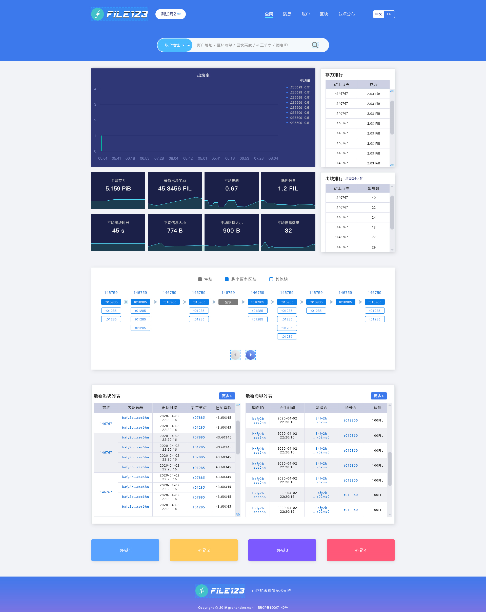
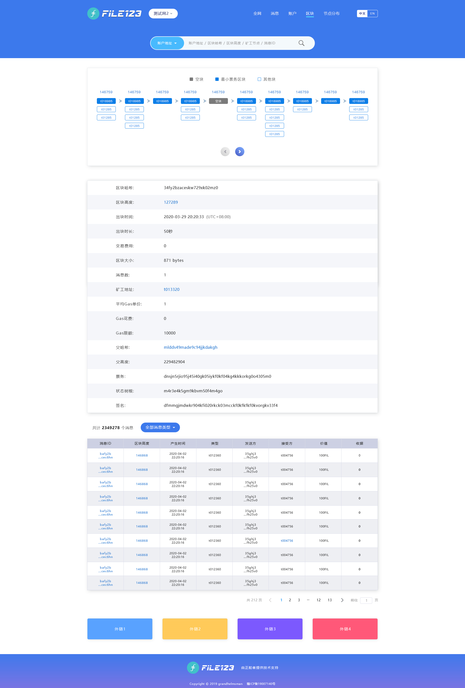
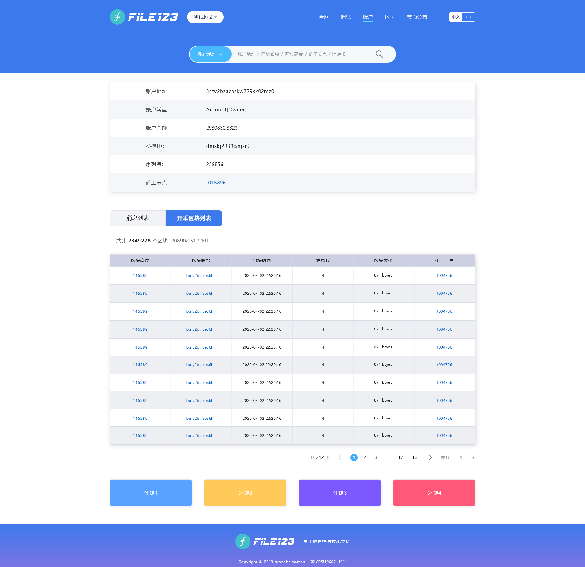

 # RFP Proposal: `Block Explorer`

 **Name of Project:** Filecoin123 Block Explorer
 
 **RFP Category:** app-dev
 
 **Proposer:** @IPFS-grandhelmsman
 
 **Do you agree to open source all work you do on behalf of this RFP and dual-license under MIT and APACHE2 licenses?:** Yes
  
 # Project Description
As a blockchain, filecoin is used by miners to record every blocksets, blocks and messages on the whole chain by a distributed way. 
Miner pays attention to their own storage capacity and storage stability, and storage users care about the balance of storage accounts. Filecoin developers pay attention to the block efficiency and transaction rate on the filecoin blockchain. 
Based on this, we will develop the filecoin123 block explorer to visually display the current status of the blockchain, and publicly provide the query of the accounts, messages, blocks and other public information on the filecoin blockchain. 

At the same time, we will integrate our query API and provide it to the relevant developers, so that their tools can query the information on the blockchain quickly, and make the the filecoin ecosystem better.

## Deliverables
-  1.A full-featured Web block explorer that can view blocks, accounts and messages.
- -It can be accessed through HTTPS: / / website;
- -It can be queried on the mobile device;
- -Fast loading and good interaction;
- -it could switch between Chinese and English;
- 2.Well documented code base;
- 3.Well document and API interface to user
- 4.Open source repository for block browser code base, dual licensed under license-mit and license-apache

## Recommended Team
- A small team with strong design and web development skills (please show evidence of this in your proposal)
- Experience creating novel data visualizations and extracting metadata from a blockchain or a complex tech back-end (APIs may not exist to extract all the information the project might need)

## Detailed Requirements & Constraints

### Data to Display
- The whole network dashboard of blockchain filecoin is displayed. Users can search blocks, accounts, messages and other information. 

- Users can quickly query each block information of filecoin; 

- User can query the details of the account; 

## Milestones & Funding
**Total Funding Amount:** 14000$ 
| Milestone No. | Milestone Description | Funding（$） | Estimated Timeframe |
| ----- | ----- | ----- |----- |
| 1 | High-fidelity design mockups, Design Interface, database, system structure Design some UI elements implemented | 3000 | 1 weeks |
| 2 | Completed implementation of dashboard of Filecoin blockchain | 4000 | 1 weeks |
| 3 | Completed implementation of searching of block、accounts、miners on the blockchain。 Compatible the mobile | 4000 | 1 weeks |
| 4 | Integrated the Api and the document All project deliverables are completed and added to the Filecoin shipyard (website, documentation, codebase) | 3000 | 1 weeks |
## Maintain plan
- 1.Maintain the update of the interface with the Filecoin blockchain, including the whole network information query in the test phase;
- 2.Upgrade the UI interface of the website;
- 3.Continuously operate and maintain the server, continuously upgrade the server, and maintain the smooth access of users;
- 4.Keep API interface and documents updated;
## Recommended Team
- ZHOU Shuyue : Filecoin Engineer and Researcher
- Chen Zhijie : FullStack Developver
- ZHAO Huayi: Product Manager
- XU Zhiyong：WEB Engineer
- YUE Manling : UI Designer
## Team Member Github Profiles
- [https://github.com/chenzhi201901](https://github.com/chenzhi201901) (personal)
- [https://github.com/free1139](https://github.com/free1139) (personal)
- [https://github.com/IPFS-grandhelmsman](https://github.com/IPFS-grandhelmsman) (personal)
## Team Website
@IPFS-grandhelmsman 
http://www.grandhelmsman.com/cn/index.html 
## Relevant Experience
Helmsman is a team dedicated to IPFS and Web3.0. We have been actively involved in the construction of distributed storage ecosystem, and as a miner, we actively participated in the storage function test of filecoin Test stage, invested a lot of equipment for testing, and saved a lot of effective data. At the same time, in the previous official first round trusted settings of filecoin, participate in the test of large storage performance. Our team has accumulated rich knowledge and experience (blockchain experience of Ethereum and Bitcoin) on the blockchain at the same time.
## Team code repositories
[https://github.com/IPFS-grandhelmsman/sarah-client ](https://github.com/IPFS-grandhelmsman/sarah-client )  
[https://github.com/IPFS-grandhelmsman/sarah-console](https://github.com/IPFS-grandhelmsman/sarah-console) 
## Additional Information
In pursuit of excellence, we are committed to becoming the leading distributed decentralized storage device and technology service provider in the industry, improving the level of information storage, communication and propagation for all human beings.
 
We have professional operation and maintenance capabilities of large-scale hardware equipment, and many years of experience rooted in the blockchain industry. We believe that we can better complete the blockchain explorer.
