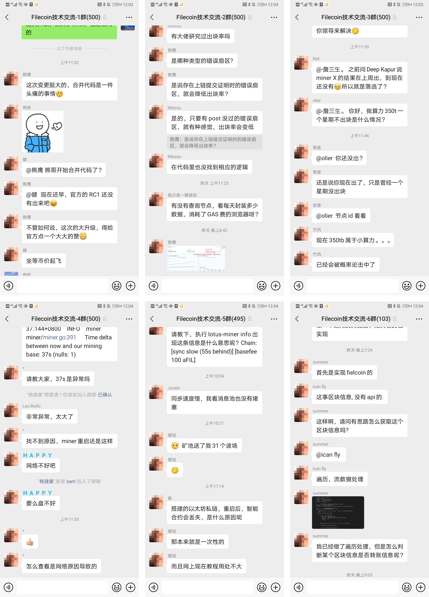

# Open Grant Proposal: `Filecoin Chinese community construction`

**Name of Project:** Filecoin Chinese community construction

**Proposal Category:** `community`

**Proposer:** [@CoinSummer](https://github.com/CoinSummer/filecoin)

**Do you agree to open source all work you do on behalf of this RFP and dual-license under MIT and APACHE2 licenses?:** `Yes`

# Project Description
Filecoin did not have a Chinese technology community from the DevNet, there are communication barriers for non-native English speakers. And chinese miners and developers are more accustomed to WeChat communication.

We built Filecoin Chinese community for all the Chinese miners and developers. We created and maintaining Filecoin Chinese technology WeChat group with more than 1.4k users. There are tens of thoursands of messages every day including hardware configuration, mining tutorial, troubleshooting, development sharing, bug trace and so on. We believe that these are the most active and useful technical community for Filecoin ecosystem.

We found that there are many duplicate questions after we created WeChat group, we also built an all in one [Filecoin Awesome resources Repo](https://github.com/CoinSummer/filecoin) for Chinese commuity. Including common resource links, commonly node operations, common Storage Miner operations, Seal Worker operations, environment variables, debugging, frequently asked questions, etc.

## Value
We built a convenient and fast communication channel for Chinese miners and developers, help them to learn mining knowledge and skills in the fastest way. Further more, we believe that all these will make the Filecoin project and its representative web3.0 concept better spread in the Chinese community.

## Deliverables
- [Filecoin Awesome resources Repo](https://github.com/CoinSummer/filecoin) with 155 stars and 77 forks. 
      
- 3 WeChat groups with more than 1.4k miners and developers.
  

## Total Budget Requested
1000 FIL

## Maintenance and Upgrade Plans
We are continue to maintain and update the github repo, and will create and manage more WeChat groups, regularly clean up inactive users in these groups, and organize more technology, scripts, mining tutorials sharing, and also encourage open source project.

# Team

## Contact info
max@coinsummer.io

## Team Members
- K
- Tears
- Max

## Team Website

[https://coinsummer.io](https://coinsummer.io)

## Relevant Experience
CoinSummer team is committed to the major cryptocurrency and blockchain projects, and has developed multiple applications and technical research on Bitcoin/Lightning Network, Ethereum, Filecoin, Polkadot and Defi.

- [CoinSummer](https://coinsummer.io): Provide cryptocurrency market insights and reliable data analysis, dedicated to creating a one-stop crypto market research platform. CoinSummer’s products include: crypto market observation, bitcoin analysis, blockchain data.
- [Crypto videos](https://coinsummer.tv): Cryptocurrency industry analysis, regulatory, trend prediction, trading strategy, fundamental analysis, industry technical analysis video, real-time tracking of the latest developments of crypto currency.
- [Lightning Network Payment SDK](https://ln.coinsummer.io): Payment SDK for Bitcoin lightning network.
- [Lightning Network Payment Web APP](https://lapp.coinsummer.io): Web APP for receive small tips and micro-payments across the web, using Lightning Network and Bitcoin.

## Team code repositories
- [lotus-jsonrpc-provider](https://github.com/CoinSummer/lotus-jsonrpc-provider): Lotus JSON RPC provider using TypeScript.
