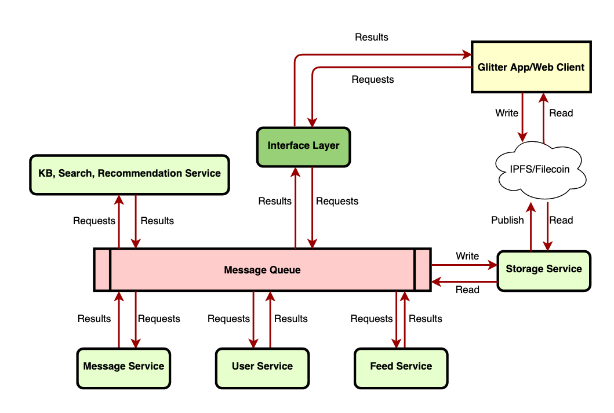

# Open Grant Proposal: `Glitter: A RSS Applications Based On IPFS`
**Name of Project:** Glitter
**Proposal Category:** `app-dev`
**Proposer:** `LiaoYuchen`
**Do you agree to open source all work you do on behalf of this RFP and dual-license under MIT and APACHE2 licenses?:** "Yes"

# Project description
Glitter is an socialized RSS reader based on IPFS, it also provides digital wallet function. Users can post articles/microblog/images/videos on various topics. All contents on Glitter is provided on IPFS, Glitter will have users content been uploaded to Filecoin network, having user a more secure service.

## Value

User can join IPFS and Filecoin very easily via Glitter, making the content creation on IPFS/Filecoin network much easier. Generate more payments on Filecoin networks by various scenarios: donation to author, transfer fund to friends and send redpacket to friends.

## Deliverables
We already have an usable demo app available, please have a try:
 - iOS: https://testflight.apple.com/join/011Tjcxw
 - Android：https://download.glitter.link/glitter.apk
 - Web: https://reader.glitter.link

## Existing tools&Services
1. Subscribe: RSS feed, Twitter, YouTube
2. Contents: Articles, Microblog, Images, Videos and sharing linkings to friends.
3. Direct Message to Friends.
4. Comments, Repost, Upvote/Downvote and Favorites
5. Wallet: We are about to support Firecoin, BTC, ETH and USDT
6. Search content on our network.

## Technical Architecture
 

Above is our technical architecture. All user data will be available on IPFS network, and user can upload some valuable data to Filecoin network.

## Milestones

- Launching a beta version on iOS/Android/Web: Apr. 2020
- Filecoin testnet support: June. 2020
- First public available version: Aug. 2020

## Total Budget Requested

We are asking for a $100000USD funding support from Filecoin Dev Grant.

## Team

We are from China, team members:
Chao Feng: Project Manager
Yuchen Liao: Tech lead and backend developer.
Liang Fang: App developer
Xin Lu: UI Design