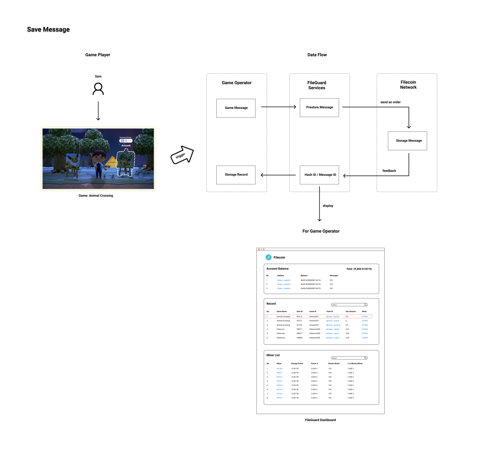

# Open Grant Proposal: `FileGuard`

**Name of Project:**
FileGuard

**Proposal Category:** 
`app-dev`

**Proposer:** 
`hashquark-research`

**Do you agree to open source all work you do on behalf of this RFP and dual-license under MIT and APACHE2 licenses?:** 
Yes

# Project Description

There are a large number of confidential data files in various business scenarios of traditional businesses that require a safe, reliable and private storage environment.The game industry is one of the businesses that has been developing rapidly since the 21st century. Especially in 2020, people's daily lives are greatly limited by the global COVID-19 epidemic. While staying at home and isolating ourselves, the game industry is even more prosperous. 

Game items are usually high-net-worth virtual assets due to powerfulness and scarcity. The price of a legend level sword with rare attributes could be worth more than 1,000 USD according to some game marketplaces. If such game items are lost due to the accident of a centralized database, game players will suffer great losses, and game operators will face losing their customers and even public relations crisis. The solution to this risk is to find a decentralized storage environment to add double insurance to gamers' high value assets which is easy to use, secure and reliable.

Filecoin network is an innovative blockchain project that provides decentralized storage solutions. However, using the Filecoin network requires professional blockchain development experience. Many traditional business practitioners have a slow process of learning and understanding it, which will undoubtedly increase the difficulty of connecting their original business systems to Filecoin network. 

## Value

### What is FileGuard and what will FileGuard do

We want to help gamers and operators use the Filecoin network more quickly and efficiently in their real business scenarios. FileGuard is designed for both game players and game operators to solve this problem. It will serve as an important infrastructure to connect the two parties, and store high-net-worth game items owned by game players into the Filecoin network.

FileGuard is a package of services. By using FileGuard, Filecoin new users can quickly integrate their business with the decentralized Filecoin storage network. The independent, universal and plug-and-play features of FileGuard enable developers to focus on their own business, reduce the cost of learning to use Filecoin, and improve development efficiency.

### How does FileGuard work

In most online games, players usually hold a bunch of game items in their backpack or warehouse within the game, or the game items are already equipped on their game characters. 

To integrate a game with FileGuard, the game operator should:
1. provide user-friendly UI for players to choose to save a certain game item on Filecoin within the game screens, as well as the display of which item is already stored on Filecoin for players.
2. prepare a Filecoin wallet with sufficient funds and import it on FileGuard. 
3. integrate their backend services with FileGuard services.

FileGuard provides a dashboard for game operators to connect their Filecoin wallets and view all the activities of the service usage of the players. The dashboard also provides some key network statistics as reference. Once the game operator send a proper request to FileGuard (a player choose to save an item to Filecoin or check his/her saved items), FileGuard will verify the validity of the request and perform the interactions of miners matching, payments, files uploading and downloading, etc. FileGuard will feedback the original requester and display the latest records on the dashboard.

Here's an example of saving items.



Sam owns an artwork in the game Animal Crossing. Assume this game is already integrated with FileGuard and Sam decided to save this artwork on Filecoin (it's called Insurance Service in this scenario). The process will go as follows:
1. Sam would like to use Insurance Service for his artwork and clicked a 'Save' button next to it.
2. The Animal Crossing's backend service sends a HTTP request with game name, user ID, item ID / asset ID and a file containing all these information to FileGuard.
3. FileGuard services pick the best storage miners and give feedback with quotes to the Animal Crossing's backend service.
4. The Animal Crossing's backend service decide which storage miner to use and call FileGuard's service. FileGuard will help making the payments.
5. FileGuard uploads the file to Filecoin and display this record on FileGuard dashboard including CID and message ID. The record will also be returned to the Animal Crossing's backend service.

Now Sam's artwork has been saved to Filecoin successfully. He will be able to check his saved artwork as well, since the record has been returned to the Animal Crossing's backend service and a UI served to check saved items should be provided by the operator.

The standard format of the saved file is quite essential. In the above example it is a json file and will look like:
```json
{
    "type": "FileGuard_Game_Items",
    "item": {
        "operator": "Nintendo",
        "game": "Animal Crossing",
        "item_id": "Artwork331",
        "owner_id": "AC212",
        "last": null,
        "item_desc": {
            "color": "green",
            "created_at": 1284871250,
            "total_amount": 5,
            ...
            }
        }
}
```

The 'last' attribute indicates the last CID of the owning record of this item, so the ownership history is always trackable.

We encourage game operators to pay the network fees for their players while they can charge altered currency within the game, so that the players won't have to learn too much knowledge of Filecoin. The versatility of FileGuard makes it compatible with most online games and game operators who run multiple games. No redundant integration work is needed.

### FileGuard features

In order to meet the various scenarios in the actual game operation, FileGuard will include the following features:
1. Files uploading and downloading: upload and download business data of game players and operators on the Filecoin network.
2. Best quotes and miners recommendations: provide for game operators as reference.
3. Wallets integration and payments: provide convenient payment methods for game players and operators, such as integrating web wallet app.
4. Fees calculating: calculate the estimated cost according to the file size.
5. Filecoin public nodes list: provide game operators with well-known public nodes in the community including HashKey.
6. Storage market orders querying: provide game operators with quotations and pending orders information.
7. Storage miners list and ranking: provides game operators with information of storage power and transaction efficiency of miners as reference.

Due to the complexity and variability of selecting storage miners and retrieval miners, FileGuard will provide miner matching algorithms to help game operators choose safe and cost-effective miners. FileGuard will recommend quotes, match miners and calculate estimated fees for game operators based on recent transaction quotations and market pending orders. Operators can easily make the final judgment to complete the file storing and retrieving actions, which improves the user experience and efficiency.

### Short-term and long-term plans

Currently we would like to implement a PoC practice of FileGuard, providing basic features to complete the process in certain scenarios. A demo web app will be provided to experience FileGuard workflow in minutes without actually integrating the whole system. 

We see FileGuard as a long term project and will continuously run FileGuard services. Our purpose is to serve as a blockchain infrastructure to bring innovative blockchain projects into existing real business and to meet actual requirements. After the basic features of FileGuard is implemented, FileGuard will support more data types business scenarios for game industry, such as game client storing and distributing. We would also like to expand FileGuard's partnership with other traditional business rather than just game industry.


## Deliverables

All deliverables will be open-sourced, dual-lisenced and well-documented.
1. FileGuard backend services
    - On-chain order list, miners list and detailed node informations.
    - File uploading and downloading.
    - The aggregated processing of historical order data and miner data in the database.
    - FIL wallet integration and payments.
    - A dashboard including game operators' business data.
2. Demo web applicaiton
    - For experiencing FileGuard's workflow of saving and checking game items.


## Development Roadmap

| Milestone No. | Milestone Description                                        | Funding | Estimated Timeframe |
| ------------- | ------------------------------------------------------------ | ------- | ------------------- |
| 1             | Finalize scope, workflow design, and architectural design | $7,000   | 2 weeks           |
| 2             | Develop                                                   | $25,000  | 8 weeks           |
| 3             | Delivery                                                  | $3,000   | 1 week            |
| 4             | Maintenance                                               | $0       | Long term         |


### Milestone 1: Finalize scope

Specifics:
The researcher will collate the data metrics to be presented and the corresponding node API endpoints to be used. The product manager and UI designer work together to discuss the interaction design and draw the UI mockups. The development engineer will design the technical architecture diagram. We will keep communicating with Filecoin Dev Grants team about these tasks at any time, and make continuous modifications according to the feedback.

People Involed:
1 Researcher, 1 Product Manager, 1 UI Designer.

### Milestone 2: Develop

Specifics:
Back-end development engineers collect data and provide real-time API. Front-end development engineers draw web pages and complete interactive graphics development. The front-end and back-end engineers work together for integration testing. In detailed, 

**2.5 weeks for:**
- On-chain order list, miners list and detailed node informations.
- File uploading and downloading.
- The aggregated processing of historical order data and miner data in the database.

**1.5 weeks for:**
- FIL wallet integration and payments.

**2 weeks for:**
- FileGuard dashboard
- Demo web application

**2 weeks for:**
- Setting up full node
- Database and full node integration
- Business logic implementation

People Involed:
3 Development Engineer, 1 Test Engineer.


### Milestone 3: Delivery

After the deployment goes online, collect user feedback and modify according to the comments. Write documentation and provide friendly user manuals. Open source after code consolidation.

People Involed:
1 Development Engineer, 1 Test Engineer, 1 Product Manager.

### Milestone 4: Maintenance

According to the function adjustment and upgrade of the main network, make corresponding adjustment on the product.

People Involed:
1 Development Engineer, 1 Test Engineer, 1 Product Manager.

## Total Budget Requested

Total Budget: $35,000

## Maintenance and Upgrade Plans

HashQuark team will maintain the system continuously. 

# Team

## Contact Info

- Tony: huzhixiang@hashquark.io
- Allen: allen@hashquark.io
- Candice: hanfengyi@hashquark.io

## Team Members

- Chen LI (Leo)
- Lianghui ZHANG (Allen)
- Fengyi HAN (Candice)
- Qingquan ZHU (Wendy)
- Zhixiang HU (Tony)
- Wanlin SONG (Adorine)
- Xiaoguang ZHANG
- WenFeng NI
- Yangyu LI
- Zhaorui ZHANG
- Guobao JIANG
- Xiaofeng ZHOU
- MengZhao SHEN
- Shiyue DAI

## Team Member LinkedIn Profiles

- Allen: https://www.linkedin.com/in/zhanglianghui/
- Candice: https://www.linkedin.com/in/fengyi-han-23b28a12b/
- Zhixiang HU: https://www.linkedin.com/in/tonyhzx/
- Xiaoguang ZHANG: https://www.linkedin.com/in/晓光-张-7a71b092/
- Wendy: https://www.linkedin.com/in/wendy-zhu-207b19140/

## Team Website

- [HashQuark](https://www.hashquark.io/)

## Relevant Experience

### PolkaCube

Besides involving in Incubation of Web3, our project [PolkaCube](https://labs.hashquark.io/#/polka) has received a grant from Web3 Foundation. PolkaCube is a project focused on providing a better staking experience for the validators and nominators of the Polkadot ecology, which include comprehensive on-chain key staking statistics monitoring, optimized staking strategy guidance and wallets integration to explore the Polkadot ecosystem and more possibilities.

The Phase 1 of PolkaCube, Staking Monitoring includes numerous on-chain statistics. The dashboard contains the amount of current validators, circulating supply, staking ratio, inflation, estimated daily reward of each validator, latest block and finalized block number, current epoch and era progress, etc. Charts and graphs also be provided for some indicators. The Phase 2 Staking Strategy provides node operation model for validators which helps node operators to make better strategic decisions to increase their service income. Bonding model is also provided for nominators to help maximize their staking rewards.

## Team code repositories

- [HashQuark Research Github](https://github.com/hashquark-io/)

# Additional Information

HashQuark, member of [HashKey Group](https://www.hashkey.com/), is a staking service provider focusing on public blockchains built upon the consensus algorithm like PoS and DPoS, and has experiences running nodes for over 40 public blockchains, including Kusama, Cosmos, IRISnet, Tezos, Klaytn, Harmony, TomoChain, Dash, IOST, Cocos, IoTeX, Factom, V SYSTEMS, ChainX, etc. HashQuark Labs is committed to the ecology and research of PoS and staking blockchains, focusing on the development of high-quality PoS projects, and providing a set of tools to enable the industry to better understand and join future products. HashQuark Open Staking Platform, part of HashQuark, has entered into partnerships with the world’s leading crypto wallets and exchanges, joining in the efforts to build a more enabling staking ecosystem. HashQuark now ranks the **No.1** staking provider globally in [StakingRewards](https://www.stakingrewards.com/providers) and has been recently named the best block producer by TokenInsight. 

CEO Leo and other team members attended quite a number of events as keynote speakers/panelists, including HashKey International Digital Asset Summit, Cosmos & IRIS launch party, Bitalk Shanghai Meetup, Global Blockchain (Hangzhou) Forum, Jinse Finance Salon, 2019 2nd Global Graphene Blockchain Developer Conference, Staking Conference, HashKey Night, etc. Other events include Polkadot Shanghai Meetup, Wanxiang Blockchain Labs & PlatON & HashKey Group meetup, and Consensus 2019.
