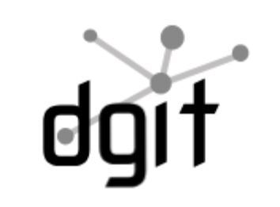
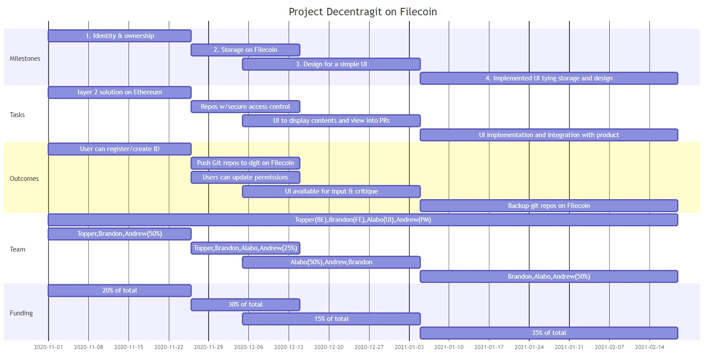

Name of project: Dgit

# Proposal category: app-dev

**Proposer:** https://github.com/tobowers

**Do you agree to open source all work you do on behalf of this RFP and dual-license under MIT and APACHE2 licenses?:** Yes

## Project description:

decentragit is an open-source project built by Quorum Control which combines the power of git with the decentralized storage of Filecoin. decentragit uses decentralized ownership and storage to make it trivial to create a decentralized, shareable git remote of your project. decentragit accomplishes this without changing your GitHub workflow except that you can keep collaborating when it goes down.

## Value:

### Benefits:
Different users have different goals. Dgit follows in the paradigm of seeing greater decentralization and distribution of data without concentration in the hands of one party. We believe a practical consideration is that with dgit, developers can continue working without interruptions to their workflow when a company’s system goes down. This issue also addresses the concerns that users have over entrusting their data to one company. 
### Risks:
The biggest risks for the dgit project is in keeping the UI functionality properly restricted. This phase of dgit development is not trying to replace github with its many different functions but rather provide a decentralized alternative and supplement to it.  For now that alternative acts as a useful supplement providing provably owned git repos which do not only reside on a particular large company’s servers.  Over time as adoption increases more of the most important functions can be replicated and the strength of dgit as a fully decentralized github alternative backed by Filecoin can increase.  At this time it's just too much for a small team to take on. The risk is simply biting off too much at once and failing to deliver. 
 
## Deliverables:

At the start of the project we will work at establishing identity and ownership on Ethereum so that users can easily register or create IDs through which they can control their repositories.

Subsequently, we will work on storage of the Github repositories on Filecoin with users having secure access control. Using this users will be able to push their Github repository to dgit on Filecoin. Further, they will be able to add team members and other collaborators as required.

Any application is incomplete without a good user experience. We will deliver a clickable version of the UI for your input. This might have to go through a few smaller iterations for the final version.

Lastly, bringing it all together we will implement the final UI version, and integrate to the final version of the product. 

For more details on Milestones, please see the Development Roadmap.

## Development Roadmap:

### Milestone 1: 
Code to establish identity and ownership on Ethereum via Layer 2 solution

**Team:**		Topper Bowers, Brandon Westcott, Andrew Holz (50%)
**Timing:**	Completed November 25th
**Funding:**	20% of total
**Functionality:**  
In order to enable a cryptographically secure and decentralized storage based code repository it is necessary for users (developers) to be able to easily establish an identity for that ownership. To reduce overhead and increase speed, the identity will be established on Ethereum through a layer 2 solution.  This component of the dgit solution will be built in Go.

At the end of this milestone, through the command line, a developer will be able to register an existing identity or create a new one via which they will own and control their repository once it has been pushed to filecoin.

### Milestone 2:
Code to establish storage of git repos on Filecoin and to provide the proper secure access controls.

**Team:**		Topper Bowers, Brandon Westscott, Alabo Briggs, Andrew Holz (25%)
**Timing:**	Completed December 15th
**Funding:**	30% of total
**Functionality:**  

The data from the git repository but appropriately compiled into a format for easy storage and subsequent retrieval.  This must be done in a computationally efficient way to avoid excessively long wait times.  The Filecoin Rest API will be put to extensive use.  This component of the dgit solution will be built in Go.

At the end of this milestone through the command line a developer will be able to (using their credentials created previously)  push their git repository to the dgit storage on filecoin.  They will also be able to set it to stay consistently in sync as further commits are made.  Finally they will be able to update permissions to include team members and collaborators as necessary.

### Milestone 3: 
Design for a simple UI to improve experience.

**Team:**		Brandon Westscott (25%), Alabo Briggs (50%), Andrew Holz, 
**Timing:**	Completed January 5th
**Funding:**	15% of total
**Functionality:**  

In order to gain wide adoption for dgit (and therefore filecoin) it will be beneficial to add a simple web interface.  This interface will be able to display the contents (if permissioned appropriately) as well as provide basic views into the PRs being made to the underlying repo.  This phase will be to design a streamlined but capable of viewing and editing the underlying repository. 

At the end of this milestone the UI will be designed and a “clickable” version of it will be provided for input and critique.  There will be several smaller iterations of this during this phase but this milestone represents the final plan. (Note this project will be done agiley so it is quite possible for this “final” UI design to be modified during further development).

### Milestone 4: 
Implemented UI tying previous 3 together
.
**Team:**		Brandon Westcott, Alabo Briggs, Andrew Holz (50%)
**Timing:**	Completed February 19th
**Funding:**	35% of total
**Functionality:** 

This final milestone represents the implementation of the UI design and the integration of all of the previous milestones into a fully functional product.  It will be built primarily in REACT and use the available APIs for identity, Filecoin, the dgit storage API on top of that.

The user will be able to backup their git repositories to filecoin, keep them in sync in the background(if they wish to continue to use github for their primary workflow), pull those repositories into new instances, make updates and invite collaborators.

## Total Budget:

Our total budgeted cost for this endeavour is USD 108,000.00. We are seeking a contribution of USD 52,000.00 as part of this grant proposal. Please check milestones for the percentage spent of the grant.

| Item                      | Unit Type | Unit | Unit Cost | Total (USD) | Planned Contribution (USD) | Grant Request (USD) |
|---------------------------|-----------|------|-----------|-------------|----------------------------|---------------------|
| Technical project manager | Per month | 3    | 8000      | 24000       | 20000                      | 4000                |
| UI Designer               | Per month | 3    | 8000      | 24000       | 12000                      | 12000               |
| Frontend Developer        | Per month | 3    | 10000     | 30000       | 12000                      | 18000               |
| DLT and Backend engineer  | Per month | 3    | 10000     | 30000       | 12000                      | 18000               |
| Total (USD)               |           |      |           | 108000      | 56000                      | 52000               |

## Maintenance and upgrade plans:

As a project that our team has been committed to, we will be hands on in making upgrades and improving the system over time. Moreover, as a project open to the Ethereum and Filecoin community, we are hopeful that there will be users that will be interested in maintaining the software. 

# Team

## Team Members:
Topper Bowers, Brandon Westscott, Alabo Briggs and Andrew Holz.

## Team Member LinkedIn profiles:
https://www.linkedin.com/in/topperbowers/
https://www.linkedin.com/in/brandon-westcott/
https://www.linkedin.com/in/andrewholz/
https://www.linkedin.com/in/alabo-briggs-31744a161/

## Team Website:
https://dgit.dev

## Relevant work experience:

The Quorum Control team has experience building DLT systems. The current team has worked on building Tupelo, a layer 1 solution. You can find more information about that project here: www.tupelo.org

### Topper Bowers
Topper Bowers is an entrepreneur and engineer with over 20 years experience building software people want. He combines deep technical knowledge with proven executive skills. He consistently pursues tech that betters people’s lives—whether he’s designing user interfaces, managing world class teams, or building high volume distributed systems for large nonprofits and Fortune 50 companies. He’s a former Y-Combinator founder (Summer 2012) with deep knowledge of distributed systems and distributed ledger technology.
 
### Brandon Westscott
Brandon Wescott is a highly experienced developer with over ten years hands on experience in a variety of industries particularly blockchain and healthcare.  He has designed systems, built them solo and as part of a team and managed teams building them.  Most recently he has been the CTO of Quorum Control.   He has deep expertise on all things related to DevOps and AWS.

### Andrew Holz
Andrew Holz is an experienced technology executive with 20+ years experience building kickass development teams large and small. Most recently, as SVP of Product and Engineering at Vitals, he has overseen the creation and delivery of enterprise products to health plans with revenue growth of over 300%. Before joining Vitals, Andrew was COO of eCaring, a mobile healthcare startup for caregivers and providers. Earlier in his career, he worked at Bell Labs as a systems engineer in the loop surveillance AI group and founded Icarus Productions, a mobile gaming company.

### Alabo Briggs 

Alabo Briggs is a software engineer with around 5 years of experience building web and mobile application infrastructure. With a background in blockchain development, he recently was a software developer at ABiT Network and other related companies based in Africa and around the Globe.

## Team code repositories:
Topper Bowers: https://github.com/tobowers
Brandon Wescott: https://github.com/brandonwestcott
Andrew Holz: https://github.com/icarusz
Alabo Briggs: https://github.com/alabobriggs

