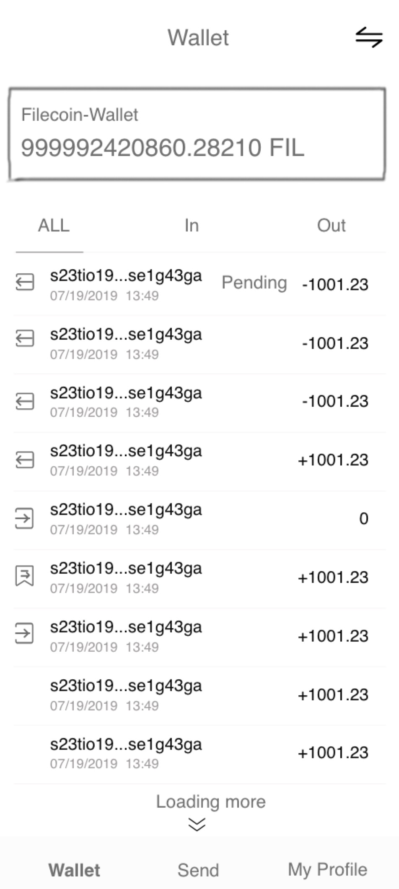

# Open Grant Proposal: Filecoin-Wallet

**Name of Project:** `Filecoin-Wallet`

**Proposal Category:** `app-dev`

**Proposer:** *[IPFS-FORCE](https://github.com/orgs/ipfs-force-community)*

**Do you agree to open source all work you do on behalf of this RFP and dual-license under MIT and APACHE2 licenses?:** `Yes`

# Project Description

Hi Labs, we are IPFS-Force team from China with several years' development experience in Blockchain Industry and deep understanding of Blockchain Activities and Actors. With solid experience, we are capable to dive and analyze multidimensional data from blockchain raw data and displayed in creative visualization.

Here’s the new proposal named “Filecoin-Wallet”.

Filecoin-Wallet is a secure, convenient, professional and web-based Filecoin wallet, that enables Filecoin user to transfer FIL and display the transaction records. For wallet’s security, it will be capable to generate random mnemonics and private keys with import and export function. To avoid data leakage and transaction security, the private keys will be stored locally.

## Value
- Easy to use, the light wallet only needs to manage the private key and send signed messages without complicated functions.
- Light wallet do not have to wait for a long time to synchronize the data on the chain, and take up a lot of resources.
- Light wallets are an important part of the ecosystem.

#### Challenges: We are going to resolve
-  Detail message struct
-  Get nonce from filecoin
-  Get gaslimit from filecoin
-  Send offline message to filecoin

*Some functions require filecoin API support. At present, we have provided a set of temporary services with a miner server, which can be used for everyone to test the transfer function. API optimization and requirement details need further discussion.*

## Deliverables
*  A full function Browser Filecoin-wallet via a https://(include mnemonic view ,transfer view, balance and transfer records view).

*  An npm package for wallet function tools which can build a filecoin wallet in browser. (mnemonic function, build transfer message function and sign)

*  A  wallet function tools library for Android and iOS to build mobile wallet.(mnemonic function, build transfer message function and sign)
*  The codebase is open-sourced and dual-licensed under MIT and APACHE2 licenses.
*  Well-documented Deployment Document, API Document and User-Guide.

## Development Roadmap

### Milestone 1

1. UI/UX Design: include mnemonic view ,transfer view, balance and transfer records view, etc.

2. Solution Research and Design: Interface, Message Data Struct, Business Process

3. Design Doc

- 1 Arch, 1 PO

- 2 weeks

### Milestone 2

1. Implementation: npm js package which can provide  mnemonic, transfer message and sign function

2. Documentation: Project Management Document, User Guide

- 1 Dev, 0.5 PM

- 1 weeks

### Milestone 3

1. Implementation: A full function Browser Filecoin-wallet, include mnemonic view ,import and export private key, transfer view, balance and transfer records view.

 - Design page examples: 1) mnemonic phases page; 2) wallet page; 3) transfer page

  
   
  

1. Documentation: Codebase, User Guide

- 1 Dev, 0.5 PM

- 2 weeks

### Milestone 4
1. Implementation: A  wallet function tools library for Android and iOS to build mobile wallet.(mnemonic function, build transfer message function and sign)

2. Documentation: Project Management Document, User Guide

*   1 Dev, 1 PM

*   2 weeks

## Total Budget Requested

Total Budget: $23,200.00

| Role | Rate/Hr | HC | Man-Hour | Man-Week | Price |
|------|--------|----|------------|------------|------|
| Arch | $80 | 1 | 80 | 2 | $6,400.00 |
| PM | $60 | 1 | 80 | 2 | $4,800.00 |
| PO | $50 | 1 | 40 | 1 | $2,000.00 |
| UI-Dev | $50 | 1 | 120 | 3 | $6,000.00 |
| Backend Dev | $50 | 1 | 80 | 2 | $4,000.00 |

## Maintenance and Upgrade Plans

1. Adjust Filecoin interface on demand

2. Website Maintenance

- Bug Fixing on demand
- Maintenance including domain name, security certificate and 1-year website service operation
   
3. Upgrade Plan

- Quarterly upgrade version
   
# Team
IPFS-Force, China Top Decentralized Storage Technology Company.

## Team Members
- Architect                 Steven Li
- Project Manager     Katrina Liu
- Product Owner        Yu Da 
- UX                    TBD
- Full-stack Dev     Feng Li
- Backend Dev        Caesar Wang
   
## Team Member LinkedIn Profiles
Steven Li: [https://www.linkedin.com/in/xinlee/](https://www.linkedin.com/in/xinlee/)

Katrina Liu: [https://www.linkedin.com/in/katrina-liu-a16a84127](https://www.linkedin.com/in/katrina-liu-a16a84127)

Yu Da: [https://www.linkedin.com/in/宇-达-219519103/](https://www.linkedin.com/in/)

Feng Li: [https://www.linkedin.com/in/felixlee20190908](https://www.linkedin.com/in/felixlee20190908)

Caesar Wang: [https://www.linkedin.com/in/麟-王-97a836149/](https://www.linkedin.com/in/%E9%BA%9F-%E7%8E%8B-97a836149/)
   
## Team Website
   
[https://ipfser.org](https://ipfser.org)
   
## Relevant Experience
   
   Our team constantly demonstrate the professionalism on the research of protocol and distributed storage system and actively participate in several Lab seminars of FIL ecosystem. Since Feb 2019, when the Filecoin is open-sourced, several team engineers have been diving into Filecoin studying, coding, and eco-system development. The team have contributed code for several projects in go-filecoin program with tens of PRs, while we pro-actively participate in devnet testing, issues submitting, and discussion of design. IPFS-Force is one of the most active communities in Filecoin eco-system everybody could see from github and slack channel. We have developed several libs and tools which could support Filecoin-Wallet development, that's why the whole schedule could be defined tightly. In addition, our Arch and Devs have seasoned experience of Blockchain and Storage projects, such as High-density Cloud Object Storage, Ethereum, Ulord, aside from Filecoin and IPFS.
   
## Team code repositories
Steven Li:[https://github.com/steven004](https://github.com/steven004)

Caesar Wang:[https://github.com/dtynn](https://github.com/dtynn)
