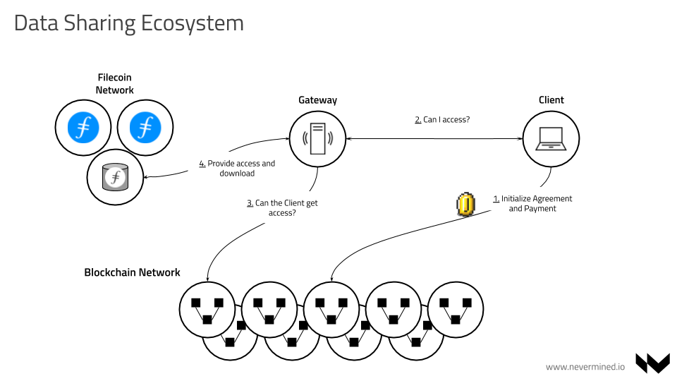
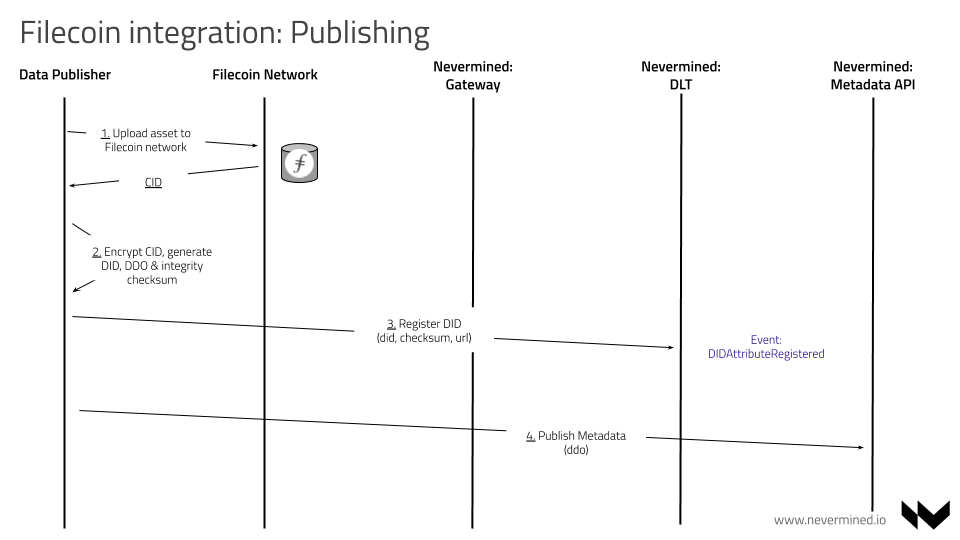
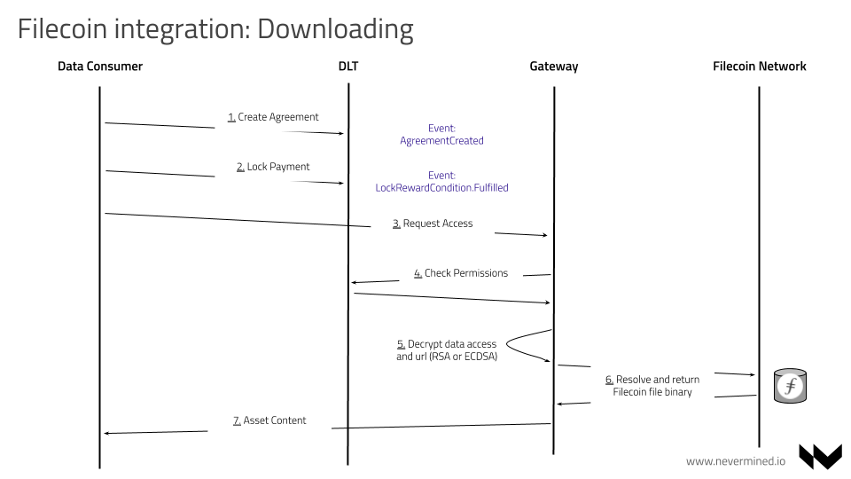

To submit a proposal, please create a PR against this template in this repo. Please title your file `open-proposal-title.md`, replacing `title` with the name of your project.

# Open Grant Proposal: `Filecoin & Nevermined integration`

**Name of Project:**

**Proposal Category:** `app-dev`

**Proposer:** `aaitor` working at `keyko-io` & `nevermined-io`

**Do you agree to open source all work you do on behalf of this RFP and dual-license under MIT and APACHE2 licenses?:** Yes

# Project Description

[Nevermined](https://nevermined.io/) is an Open Source solution developed by [Keyko](https://keyko.io/), offering its users the ability to build data sharing ecosystems where untrusted parties can share and monetize their data in a way that’s efficient, secure and privacy preserving. As data creation continues to proliferate, entities have the necessity of organising, understanding, using and sharing their data internally and externally. Nevermined provides Data Sharing and Data In-Situ Computation solutions that allow organizations to unlock data for a more insights-driven approach.

What we call a Data Ecosystem is an environment where independent organizations can cooperate with each other to publish, discover, and access data and the associated assets and services. Nevermined enables the usage of data without the members of these ecosystems having to lose control of their assets. One of the main principles of Nevermined is that Data Owners and Providers always keep control of their data. The solution is designed to be integrated with existing Big Data environments and allows for the execution of models or algorithms in-situ, or where the data resides. With Nevermined, the data never moves; instead the algorithms and models move to where the data sits.

Currently Nevermined integrated with the most popular centralized/cloud based storage providers (Amazon S3, Azure, etc.). Our intention is to integrate Nevermined with Filecoin allowing to:

- Use Filecoin as one of the options supported allowing Nevermined users to publish & share their data via Filecoin
- Facilitate access control & data monetization of Filecoin existing data
- Execution of models and algorithms on Filecoin miners infrastructure without moving the data

## Value

The integration of Filecoin into Nevermined brings is valuable for Filecoin community because:

- Increase the usage of Filecoin network
- Provides utility to Filecoin network via integration with existing and mature Open Source software
- Filecoin doesn't provide a granular access control allowing to the data owners or publishers to decided when their data can be accessible
- Allows user using centralized data storage based on cloud providers to use Filecoin as alternative
- Nevermined is L2 solution, network independent, and can be deployed in public or private networks. Via this integration, Filecoin could be used in any Nevermined user deployment
- Nevermined provides compute to the data and provenance (based on W3C PROV) capabilities. Via the integration, the Filecoin community would be able to use high value capabilities on top of their data

## Deliverables

The integration of Filecoin as a storage provider fully supported would require the modification and delivery of the following components:

* The Nevermined Gateway. This component is in charge of making available Nevermined users data. Currently it supports different storage providers (Amazon S3, Azure, On Premise, etc.). It would be necessary to integrate Filecoin in that gateway and deliver a new version allowing to resolve Filecoin CIDs.
* The Nevermined SDKs. To facilitate user adoption, Nevermined support SDKs in 3 different programming languages:
  - Javascript, to facilitate the integration of Nevermined in web interfaces
  - Python, to facilitate the integration of Nevermined in data science tools
  - Java, to facilitate the integration of Nevermined in data engineering pipelines
  It will deliver a modification of the 3 SDKs allowing to the users to publish in Nevermined Filecoin contents (CIDs)  
* Marketplace. It's a frontend application where users can publish and share files. The intention is to modify this application to support data sharing of assets stored in the Filecoin network.

## Development Roadmap

The final goal of the delivery is to have a fully functional end to end, allowing the registering of existing Filecoin assets into Nevermined network:

After this publishing flow, it's intended to provide the downloading functionality (after access control) of Filecoin contents registered in the Nevermined network:

The deliverables would be:

### Sprint 0. Research and Architecture

**Objectives:** Detail the technical architecture needed and document the elements to put in place

**Tasks:**
- Write the technical architecture
- Investigate how the gateway can be integrated with Powergate or directly with a Lotus node

**Duration:** 1 week

### Sprint 1. Adding Filecoin support to Nevermined Gateway

**Objectives:** Deliver a version of the Nevermined gateway able to resolve Filecoin files

**Tasks:**
- The Gateway needs to support the connectivity with the Filecoin network via Powergate or a Lotus node. This behavior needs to be able to be connected/disconnected from the Gateway via configuration.
- The Gateway needs to support the usage of an existing Filecoin wallet.
- When a Nevermined asset is resolved and includes a CID, the gateway need to be able of resolving that file and return to the final user
- PR merged in the Gateway master branch including the Filecoin support. New release of the gateway shipping this functionality.

**Duration:** 1 week

### Sprint 2. Adding Filecoin support to SDKs

**Objectives:** Deliver a version of the Nevermined SDKs (java, python, js) allowing the registering of Nevermined assets resolving to Filecoin files

**Tasks:**
- The publishing flow of Nevermined assets needs to allow to include CIDs as files
- The consumption flow of Nevermined assets needs to integrate the gateway and work with assets including Filecoin files
- PRs merged in the Java, Python and Javascript Nevermined SDKs. New releases of each SDK library.

**Duration:** 1 week

### Sprint 3. Adding Filecoin support to Marketplace

**Objectives:** Deliver a version of the Nevermined marketplace user interface allowing the registering of Nevermined assets stored in Filecoin network

**Tasks:**
- The visual publishing flow of Nevermined assets needs to allow to include CIDs as files
- The consumption flow of Nevermined assets needs to integrate the gateway and work with assets including Filecoin files
- PR merged in the Marketplace master branch including the Filecoin support. New release of the application shipping this functionality.

**Duration:** 2 week

### Sprint 4. Communication

**Objectives:** Communicate to Nevermined and Filecoin communities the availability of the new integration

**Tasks:**
- Document the whole process allowing to the users to understand how to enable the features
- Record a Demo showing how data published on Filecoin network can be registered on Nevermined and be accessed
- Publish a blog post with the technical details and summary of the integration

**Duration:** 1 weeks

## Total Budget Requested

The total budget requested across all milestones is the equivalent to XXX USD in FIL token. These funds are expected to be used for paying the development effort required for this implementation, and the further maintenance of this feature during the next months.

## Maintenance and Upgrade Plans

All the implementations resulted from this development will be merged as part of the Nevermined main code. As a result of that, the code and functionality will be supported as long the Nevermined components are being used by the community.

# Team

## Team Members

- Rodolphe Marques (Github: [https://github.com/r-marques](@r-marques))
- Enrique Ruiz (Github: [https://github.com/eruizgar91](@eruizgar91))
- Aitor Argomaniz (Github: [https://github.com/aaitor](@aaitor))

## Team Member LinkedIn Profiles

- [Rodolphe Marques](https://www.linkedin.com/in/rodolphemarques/)
- [Enrique Ruiz](https://www.linkedin.com/in/enrique-ruiz-garc%C3%ADa-a2123439/)
- [Aitor Argomaniz](https://www.linkedin.com/in/aitorargomaniz/)

## Team Website

- https://www.nevermined.io/
- https://keyko.io/

## Relevant Experience

Beyond our experience during the last 2 years building Nevermined, our team has several years of background in data, blockchain and machine learning. We have worked in several organizations and projects related to these topics. As a proof of that, during the last year and a half our team participated in the delivery network launch of different blockchain projects: (Ocean Protocol/2019, Celo/2020, Filecoin/2020, Bancor/2020). This is complemented with many years of experience building Open Source software in different organizations (Github orgs):

* [https://github.com/keyko-io](@keyko-io)
* [https://github.com/nevermined-io](@nevermined-io)
* [https://github.com/bigchaindb](@bigchaindb)
* [https://github.com/oceanprotocol](@oceanprotocol)
* [https://github.com/stratio](@stratio)
* [https://github.com/xaynetwork](@xaynetwork)
* [https://github.com/filecoin-project](@filecoin-project)
* [https://github.com/celo-org](@celo-org)
* [https://github.com/bancorprotocol](@bancorprotocol)

## Team code repositories

All the Nevermined projects are Open Source and can be found on Github (https://github.com/nevermined-io/).
Here a list of the most relevant repositories:

* https://github.com/nevermined-io/gateway
* https://github.com/nevermined-io/sdk-js
* https://github.com/nevermined-io/sdk-py
* https://github.com/nevermined-io/sdk-java
* https://github.com/nevermined-io/contracts
* https://github.com/nevermined-io/tools
* https://github.com/nevermined-io/cli

# Additional Information

Please include any additional information that you think would be useful in helping us to evaluate your proposal.
