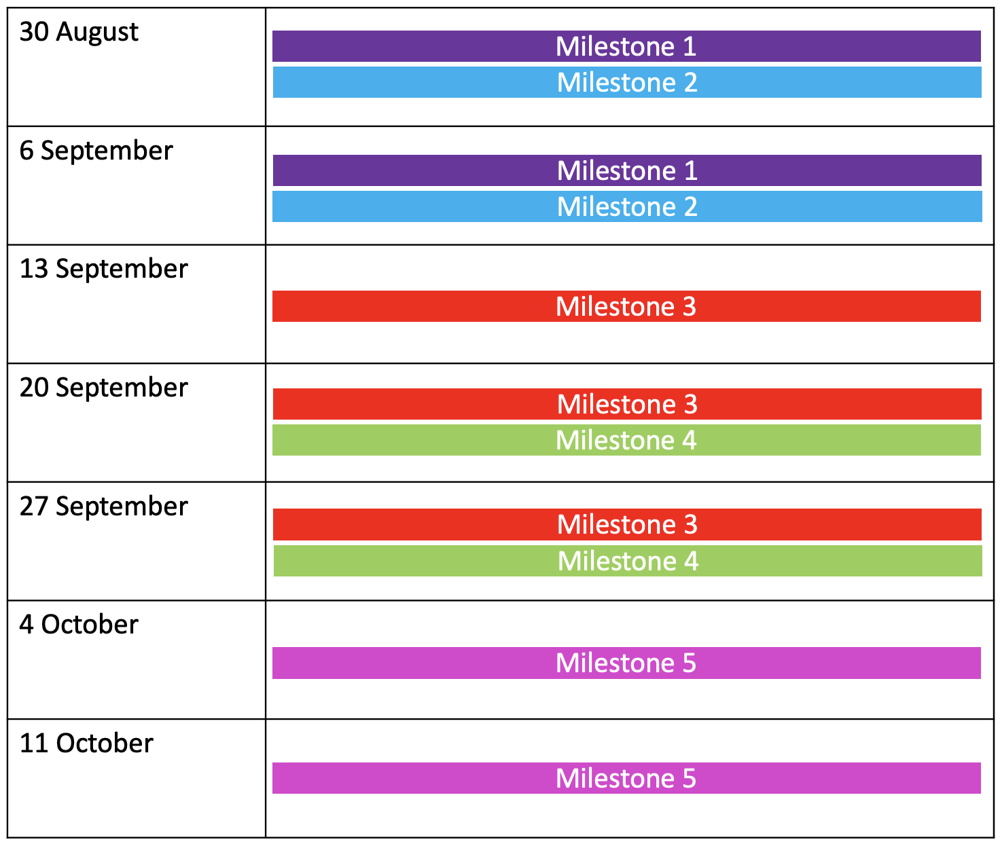

# Open Grant Proposal: `Opscientia - proposal for research and technical design into hosting large neuroscience datasets on IPFS`

**Name of Project: Opscientia - proposal for research and technical design into hosting large neuroscience datasets on IPFS**

**Proposal Category:** `technical-design`

**Proposer:** `XandraMcC`

**Do you agree to open source all work you do on behalf of this RFP and dual-license under MIT and APACHE2 licenses?:** Yes

# Project Description

Neuroimaging data is being generated more quickly than institutional infrastructure can keep up with in regards to storage and tools to sift through the deluge of scientific information. Decentralised file storage protocols offer solutions to these problems via content addressable data, programmable incentives for data storage, provenance tracking, censorship resistance, and bandwidth/speed that scales with global adoption. 

Our team developed a proof-of-concept of our Open Science Data Wallet at the ETHGlobal Web3Weekend. We were chosen as finalists and also won the Textile.io prize and IPFS blog recognised us as a project that most inspired them. This proposal is to carry on with this idea and research the backend of how we would handle large data (tens to hundreds of terabytes) on IPFS and how we can integrate that into our data wallet. We also want to carry out in-depth user-research into what our scientific users want and from there develop feature requirements for future product development.

We are partnering with DANDI (Distributed Archives for Neurophysiology Data Integration) at MIT which is funded by the US government BRAIN initiative (set up by the Obama administration) to test if IPFS can successfully support 2.5 terabytes of brain data. This data is currently non-human and is stored centrally on AWS. However, when human brain data starts being collected by DANDI, and other neuroscience laboratories, there is an inherent ethical risk of storing human data with Big Tech companies. This is where decentralised data storage comes in and we would like to leverage IPFS to help verify and build a solution that helps scientists to store their data in an ethical manner.

**Milestones for this project:**
1. Build on initial user-research with users (neuroscientists)
2. Validate and design the backend of our data wallet to be able to host large datasets
3. Build *open science data wallet v1*
4. User-requirement design
5. Validate *open science data wallet v1* with users (neuroscientists)

**Relevant links:**
- DANDI - https://www.dandiarchive.org/

## Value

We will carry out a thorough evaluation of IPFS for large volumes of scientific data. This design is grounded in research, ethics and the end user is at the heart of what we are building. If we get this right it will be the first and largest validation of scientific data being hosted on IPFS. This will provide proof that large amounts of sensitive data can be stored in a decentralised manner and will provide the validation needed for institutions such as MIT to start moving away from centralised storage systems.

The risks of not carrying out thorough research and validation and research are great. We want to do this now, before DANDI starts collecting human brain data so that we can be set up and ready to go when the time comes. It is important to note that the DANDI team looked at using IPFS a couple years back but did not have the time and resources at the time to explore it as an option. We believe that this will be highly valuble to them and 

What are the risks that will make executing on this project difficult?

## Deliverables

At the end of these 6 weeks we will have:
- Designed the backend of our *open science data wallet*
- Developed version 1 - *open science data wallet v1*
- Designed feature requirements for future product development
- Validated our product with end-users

## Development Roadmap

<!-- Please break up your development work into a clear set of milestones. This section needs to be very detailed (will vary on the project, but aim for around 2 pages for this section).

For each milestone, please describe:
- The software functionality that we can expect after the completion of each milestone. This should be detailed enough that it can be used to ensure that the software meets the specification you outlined in the Deliverables.
- How many people will be working on each milestone and their roles
- The amount of funding required for each milestone
- How much time this milestone will take to achieve (using real dates) -->

Opscientia will test the feasibility of loading a 2.5 TB Human Brain image using Neuroglancer with distributed storage running on the backend. We may also explore setting up redundant pinning nodes at the Pittsburgh Supercomputing Cluster/MIT Net to complement the IPFS/filecoin solution.

### Key questions to address through the overall project:
1. Can researchers upload data to our wallet?
2. Can researchers access uploaded data?
3. Can researchers "do science" on uploaded data?
4. How do latencies compare to centralised storage (i.e. S3 buckets)?
5. How will it integrate and perform with *Neuroglancer* (WebGL-based visualisation tool)?

### Milestone 1: Build on initial user-research with users (neuroscientists) - 2 weeks (30 August - 10 September)

**Aim:**
User research with target audience (Distributed Archives for Neurophysiology Data Integration (DANDI) affiliated lab researchers) to understand data needs.

**Method:**
In-depth 1:1 interviews with DANDI affiliated members (n=5)

**User research protocol:**
- Obtain info about researcher (e.g. career level, experience with Web3 tools, etc) - these will be used to build user personas
- Ask user to outline current journey for uploading and accessing DANDI data
- Enquire about pain points in current process (including sources of friction, points of risk for error, latencies)
- Ask user to explain needs once data is uploaded (e.g. cleaning/processing (including "pinning"), visualisation, analysis, sharing, and current tools for this)
- Explain basic data wallet steps and identify initial thoughts, concerns and questions

**Outputs:**
User personas, current state user journey map, feature requirements for POC, user FAQs

**Team members:**
- Shady (part-time) - user-researcher focusing on institutions
- Sarah - user-researcher focusing on scientists

### Milestone 2: Research and design the backend of *open science data wallet v1* (working group feasibility research) - 2 weeks (30 August - 10 September)

**Aims:**
- Gather benchmarks on data ingress and egress speeds using Textile/Filecoin/IPFS
- Test feasibility of storing a ~2.5TB brain image, and see if latency is low enough to view the image on Neuroglancer. Compare latency and costs with traditional AWS bucket storage.
- Research methods to control the level of storage redundancy - ensure at least n=2 nodes are pinning the data at all times
- Research methods to handle relationship between metadata and raw data, considering pros & cons of on-chain & off-chain designs

**Team members:**
- Shady (part-time) - product owner
- Alexandra - technical architect
- Achintya - technical researcher
- Kinshuk - technical researcher

### Milestone 3: Build *open science data wallet v1* - 2 weeks (13 September - 24 September)

**Aims:**
- Build backend proof-of-concept and integrate with data wallet front-end
- Have the ability to upload large datasets through wallet interface incl. metadata
- Configure datasets as public, private with the ability to permission data
- Integration with DID schemas (Ceramic/IDX)
- Integration with neuroglancer as a protocol, by building an extension using IPFS as the remote

**Team members:**
- Shady - product owner
- Alexandra - full-stack engineer
- Achintya - full-stack engineer
- Kinshuk - full-stack engineer

### Milestone 4: User-requirement design - 2 weeks (13 September - 24 September)

**Aim:** 
Turn user needs (identified through user research) into requirements for the end state product

**Method:** 
Take each need, research tools available/current tools leveraged by users, investigate if and how these can be incorporated into the user journey for our end product, prioritise each for the product roadmap

**Outcomes:** 
Fully designed product that meets user needs, implementation roadmap 

**Team members:**
- Sarah - technical designer

### Milestone 5: Validate *open science data wallet v1* with users (neuroscientists) - 2 weeks (27 September - 15 October)

**Aim:** 
User research with target audience (DANDI affiliated lab researchers) to gather feedback on POC.

**Method:** 
1:1 user testing with DANDI affiliated members (n=5; recruit same group as before where possible)

**User-research protocol:**
- Show solution to user and provide brief instructions
- Provide a series of scenarios plus detailed documentation to the user: 1. upload dataset, 2. process/visualise/analyse uploaded data, 3. download data, 4.share/permission data
- User completes each scenario while narrating thoughts to interviewer 
- Ask user for thoughts, concerns and questions on the experiences

**Outputs:**
Validation of whether each feature (and documentation) meets user's needs, identification of areas for further improvement/iteration

**Team members:**
- Shady (part-time) - user-researcher focusing on institutions
- Sarah - user-researcher focusing on scientists
- Alexandra (part-time) - technical researcher focusing on technical feedback from institutions & scientists

### Overall timeline:

## Total Budget Requested

**Total: USD$ 26,800**

We are budgeting for 7 weeks of work to research, design, develop *open science data wallet v1*, and validate with users. This will also enable us to carry out significant user-reseach to  develop a clear roadmap to further build on v1.

#### Milestone 1: Build on initial user-research with users (neuroscientists) - 2 weeks (30 August - 10 September)
|Team members required: | rate (per hour) | time (hours) | total |
|-----------------------|-----------------|--------------|-------|
| Shady | USD$30 | 40 | USD$1200 |
| Sarah | USD$30 | 80 | USD$2400 |
| | | | **USD$3600** |

#### Milestone 2: Research and design the backend of *open science data wallet v1* (working group feasibility research) - 2 weeks (30 August - 10 September)
|Team members required: | rate (per hour) | time (hours) | total |
|-----------------------|-----------------|--------------|-------|
| Shady | USD$30 | 40 | USD$1200 |
| Alexandra | USD$30 | 80 | USD$2400 |
| Achintya | USD$20 | 80 | USD$1600 |
| Kinshuk | USD$20 | 80 | USD$1600 |
| | | | **USD$6800** |

#### Milestone 3: Build *open science data wallet v1* - 3 weeks (13 September - 1 October)
|Team members required: | rate (per hour) | time (hours) | total |
|-----------------------|-----------------|--------------|-------|
| Shady | USD$30 | 80 | USD$2400 |
| Alexandra | USD$30 | 120 | USD$3600 |
| Achintya | USD$20 | 120 | USD$2400 |
| Kinshuk | USD$20 | 120 | USD$2400 |
| non-human costs |  |  | USD$2000 |
|   |   |   | **USD$10400** |

#### Milestone 4: User-requirement design - 2 weeks (20 September - 1 October)
|Team members required: | rate (per hour) | time (hours) | total |
|-----------------------|-----------------|--------------|-------|
| Sarah | USD$30 | 40 | USD$1200 |
| | | | **USD$1200** |

#### Milestone 5: Validate *open science data wallet v1* with users (neuroscientists) - 2 weeks (4 October - 15 October)
|Team members required: | rate (per hour) | time (hours) | total |
|-----------------------|-----------------|--------------|-------|
| Shady | USD$30 | 40 | USD$1200 |
| Sarah | USD$30 | 80 | USD$2400 |
| Alexandra | USD$30 | 40 | USD$1200 |
| | | | **USD$4800** |

## Maintenance and Upgrade Plans

- Scaling up to larger datasets
- Continuous user-research / feedback
- Documentation / tutorials
- Integration with our DeSci Stack

# Team

## Team Members

- Shady El Damaty PhD
- Sarah Hamburg PhD
- Alexandra McCarroll MSc
- Achintya Kumar
- Kinshuk Kashyap

## Team Member LinkedIn Profiles

- https://www.linkedin.com/in/seldamat/
- https://www.linkedin.com/in/sarah-hamburg-phd-9510a910a/
- https://www.linkedin.com/in/alexandra-mccarroll-469108133/
- https://www.linkedin.com/in/achintya-kumar1/
- https://www.linkedin.com/in/kinshuk-kashyap-32a4747b/

## Team Website

https://opscientia.com/

## Relevant Experience

We are a highly educated, cross-functional, global team with a clearly shared vision to develop a community-owned neuroscience ecosystem that unlocks data silos, reolutionises collaboration, and democratises funding. Our team spans the globe from India, the U.K, the U.S., Spain, Egypt, and Hong Kong.

Shady El Damaty, PhD, is our founder and product manager. He has an extensive quantitative background contributing to methods development and digital infrastructure for neuroscience research.

Sarah Hamburg, PhD, is our product strategist. She is a neuroscientist with years of experience in human neuroimaging, user experience research, and product development.

Alexandra McCarroll, MSc, is our full-stack software engineer and technical architect with experience as both a software and data engineer. In her past she has worked with both big institutions and FinTech startups.

Achintya Kumar, is Opscientia's Open Web Fellow, who is applying his web development skills to build the decentralised science stack. He is our front-end enthusiast and resident DID expert.

Kinshuk Kashyap, is Opscientia's Google Summer of Code Fellow, who was awarded a competitive summer fellowship. He is our resident IPFS expert with a passion for decentralised neuroscience data.

## Code repositories
- Opscientia GitHub organisation - https://github.com/opscientia
- Our Web3Weekend Hackathon showcase page - https://showcase.ethglobal.co/web3weekend/open-science-opsci-data-wallet
- The data wallet code - https://github.com/opscientia/web3weekend-hackathon

## Team Github Handles
- Shady - https://github.com/seldamat
- Sarah - https://github.com/shamburgularara
- Alexandra - https://github.com/XandraMcC
- Achintya - https://github.com/Ackintya
- Kinshuk - https://github.com/kinshukk
