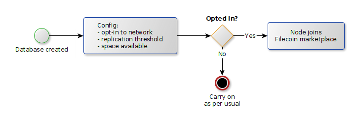
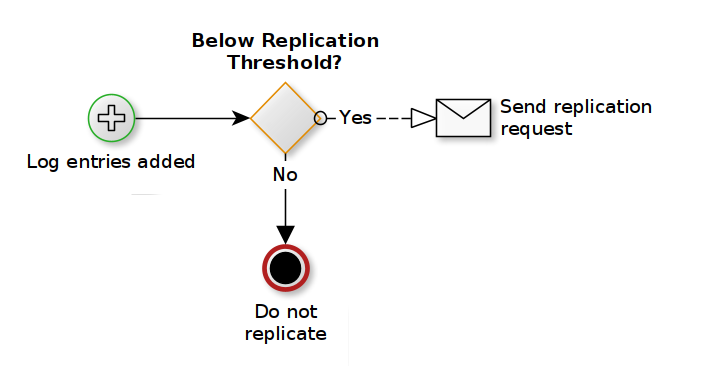
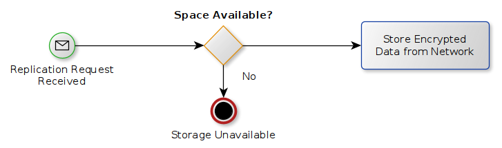

# Open Grant Proposal: `OrbitDB Net-Zero Pinning Community Network`

**Name of Project:** `OrbitDB Net-Zero Pinning Community Network`

**Proposal Category:** `app-dev`

**Proposer:** `@aphelionz` on behalf of `@eqlabs`

**Do you agree to open source all work you do on behalf of this RFP and dual-license under MIT and
APACHE2 licenses?:** Yes

# Project Description

[OrbitDB](https://github.com/orbitdb/orbit-db) is a distributed database engine that stores its
data on IPFS as Conflict-free Replicated Data Types (CRDTs). OrbitDB has a number of prominent
users including [Metamask](https://metamask.io), [bitcoin.com](https://bitcoin.com),
[3Box](https://3box.io/), [AvionDB](https://dbdb.io/db/aviondb),
and [BitcoinCash](https://www.bitcoincash.org/).

Of all the features and improvements requested by our community, reliable pinning is perhaps the
most common. An OrbitDB user wants their data to persist in the distributed swarm safely and
reliably, with minimal configuration and attention required.

This harmonizes with the adage that token economies work best when they're completely transparent to
the user and handle accounting "under the hood". In the case of OrbitDB, the system could
theoretically handle both sides of the the data storage transaction. OrbitDB nodes can be both
miners and requestors of the data stored, and the nature of the commodity that the token represents -
in this case data storage - makes a "take what you give" economy feasible.

If this grant is funded, we will deliver a Filecoin integration to power a baseline "net-zero"
community swarm for any OrbitDB instance that wants to opt-in, allowing people to create and
respond to "replication requests" from each other, only storing what they provide, and vice versa.

Ideally, this would happen as opaquely as possible, i.e. it should "just work."

## Value

At nearly [4,500 GitHub](https://github.com/orbitdb/orbit-db/stargazers) stars, OrbitDB is one of
the more high-profile projects in the `js-ipfs` ecosystem. This means we have a track record of
positive impacts that OrbitDB has already had on a prominent Protocol Labs project.

The benefits of this have so far been:

1. Raising awareness of IPFS through its transitive use in OrbitDB
2. Driving improvements in IPFS due to community demand and response to OrbitDB

It follows, then, that Filecoin could enjoy similar, synergistic effects with OrbitDB. The process of
implementing this pinning network and its future users are very likely to provide valuable
context and feedback to the Filecoin Project, and drive the project roadmap forward.

### Risks

Of course this outcome is not guaranteed, and not without risk. During the initial planning
process the grant team has identified the following risks that could impact either the
implementation process or the desired outcome of the grant effort. Under each risk heading
is a analysis of the risk's likelihood and impact, as well as an analysis and mitigation.

#### Differences between the requirements and design of OrbitDB vs Filecoin
> Likelihood: Certain | Impact: Medium-high

Filecoin's desired sector sizes might be greater than the ones practical to OrbitDB
and the uptime requirements in Filecoin might be too strict for non-profit purposes. This is the reason
why we are choosing to create our own DevNet as a "proving ground" for the concept itself.

#### The pinning community's opt-in rates might not fit a net-zero/non-profit mode
> Likelihood: Medium | Impact: High

For this concept to work, there will need to be a number of guarantees in place, regardless of
OrbitDB's requirements - a sufficient number of copies of the data need to be available on the network
to pin reliably, which means we will need a consistent number of online nodes. Equilibrium can
mitigate this risk by maintaining one or more persistent nodes that can carry a larger amount
of data than a typical OrbitDB node.

#### Last-minute changes/issues with Filecoin network/client behavior
> Likelihood: High | Impact: Low

As of this writing, Filecoin is still in active development prior to its planned MainNet launch.
Things can and will change fast, potentially even after the MainNet launch. The grant team simply
accepts this risk and we will plan accordingly. The practical upshot of this is that we will allot
slightly more time in our milestone schedules to account for such contingencies.

### Benefits

If this project succeeds, OrbitDB's users will be happily pinning their data without having to know
too much about the underlying details, and Filecoin will have a successful example of a net-zero,
non-profit pinning community running within its network.

Also, as mentioned in the [value](#value) section above, the effort itself will raise awareness of
Filecoin as well as help steer the roadmap based on real-world usage. It could also open the door
to other opportunities for Filecoin and OrbitDB within the non-profit space.

## Deliverables

We plan on breaking this work up into three smaller milestones, described in the next section. At
each milestone, we will deliver the following:

### Milestone 1 - Research and Design

- A formalized spec detailing the pinning network's functionality and its economy
- A working DevNet with parameters tailored to OrbitDB needs

### Milestone 2 - Implementation

- A public repository with a working implementation of an OrbitDB node equipped with Filecoin
pinning capabilities
- Documentation, tests, and instructions

### Milestone 3 - Launch and Outreach

- One or more blog posts detailing the need and solution presented
- Social marketing efforts like posts and chat room announcements
- A docker image with a small OrbitDB net-zero community or node

## Development Roadmap

As per the [Risks](#risks) section, this is subject to change as the project and Filecoin
itself mature over the coming months.

Note: The budget in the milestone is based on the _equivalent_ of one full-time developer working
on the project at a time. This metric is used for ease of understanding and the work may be the
result of many team members via more granular chunks of work.

### Milestone 1 - Research and Design

In this phase we will first set up a DevNet using the
[lotus instructions](https://docs.lotu.sh/en+setup-local-dev-net).
This DevNet will have significantly reduced sector sizes in order to allow local development. Relaxing uptime requirements is something
that is desirable, however this may not be feasible and will require additional research. We will also
research relationship with "regular" nodes on MainNet, and how that might work.

As for the pinning network itself, the current (rough) design is:

Upon database creation, the OrbitDB node will also create a Filecoin miner and start its daemon. If they are opted
in, they will join the Filecoin network and make a user-specified amount of storage available.

As log entries are added or replicated, the node will first check to see how many copies are currently
on the network. If the number of copies is below a user specified amount (for example, 5 copies) then
a request for storage is sent out to a random miner.

Since every OrbitDB node is both a miner and a network user, they can also receive storage requests.
When such a request for storage is received, the node will check its avaialble storage space in its
sectors, and fulfill the request if it is within its capacity.

**Estimated duration:** 2 weeks 
**Estimated cost:** 4800€ / 5,390.71 USD

### Milestone 2 - Implementation

#### Milestone 2a - Back-End Filecoin Network Implementation

Once the spec has been created and the design details are more solidified, the next step will
be to create the implementation in the form of a JavaScript implementation that interacts with
both OrbitDB and Filecoin.

This details of this work are highly dependent on the spec, but one notable detail is that
OrbitDB works both in the browser (either through an embedded `js-ipfs` node or via the IPFS
HTTP API), and on the server, via node.js. We would like to maintain this property while we
build out the Filecoin pinning service as well, by primarily interfacing with a Filecoin
node through its HTTP APIs.

**Estimated duration:** 3 weeks 
**Estimated cost:** 14,400€ / 16,172.14 USD

#### Milestone 2b - Front-End UI Interface

We will expand upon the [OrbitDB Control Center](https://github.com/orbitdb/orbit-db-control-center)
project to build a UI to make it simple for users to take advantage of the pinning functionalities,
and understand their own relationship in the context of the network - how much space they are
providing, as well as how much space is available to them and their data.

**Estimated duration:** 2 weeks 
**Estimated cost:** 9,600€ / 10,781.42 USD

### Milestone 3 - Launch and Outreach

Once the repostitory is created and a suitable version is finalized, we will begin to seek
users for testing and feedback. This will involve a number of non-technical efforts, as well as
some additional technical endeavors:

- Two blog posts (one at the beginning of this project and one at the end) detailing the plan and its outcome
- Social media posts and attentive responses to comments and questions
- A docker image that contains either the enhanced Filecoin+OrbitDB node or a working network with a few nodes
- Additional technical support on chat platforms such as Gitter, Discord, and Matrix
- Other optimizations and bug fixes that might arise during this period

There may be additional items here based on community needs and feedback, such as mentoring, but
these are more difficult to quantify.

**Estimated duration:** 2 weeks 
**Estimated cost:** 4800€ / 5,390.71 USD

## Total Budget Requested

- **Total estimated duration:** 9 weeks
- **Total estimated cost:** 33,600€ / 37,734.98 USD

## Maintenance and Upgrade Plans

We want to create a codebase that will last into the future. Equilibrium, along with the support
of the community, pledge to continue to maintain the new OrbitDB functionalities to the best of their
ability, within any existing financial constraints.

Much like we will build upon community efforts, we will also enable and encourage others to build
upon our work. This will be a twofold effort that includes both permissive licensing and community outreach:
onboarding as many new contributors as possible, mapping the work out into issues of different levels of
difficulty, and providing mentorship.

# Team

The team is comprised of the following [Equilibrium](https://equilibrium.co) team members.

We believe this team is uniquely qualified to complete this task, both the implementation
and communicating with the community in terms of the provided reference implementation and best
practices when using, implementing, and interacting with OrbitDB and Filecoin in general.

## Samuli Pöyhtäri
> [[github](https://github.com/haadcode)] [[linkedin](https://www.linkedin.com/in/samuli/)]

Samuli is the originating author of OrbitDB and is now the CTO at Equilibrium. Formerly the CEO at Haja,
Samuli and Vesa-Ville created and published the [Ambients](https://ambients.org) Protocol.
Samuli has published research related to data interoperability protocols and data structures, as
well as several open source projects and modules for the OrbitDB ecosystem. He was also an early
core developer of IPFS.

## Mark Henderson
> [[github](https://github.com/aphelionz)] [[resume](https://ipfs.io/ipfs/QmcHxD94cvJgq5ZZxQkEi7SRMwD5dBnkhQ3zzaVFqNWFJb)]

Mark Henderson is a core contributor to OrbitDB. For over a year, his full-time job was working
on OrbitDB which, in addition to adding features and increasing performance in the distributed
OrbitDB system, entailed both personally dealing with the more complex features of IPFS and
helping community members do the same.

## Vesa-Ville Piiroinen
> [[github](https://github.com/vvp)] [[linkedin](https://www.linkedin.com/in/vesa-ville-piiroinen-5b6b14/)]

Vesa-Ville is the Chief Research Officer at Equilibrium. As former CTO and co-founder of Haja
Networks, he worked on the original theory, research and design of the [Ambients](https://ambients.org),
a protocol for distributing and executing deterministic programs safely in a decentralized,
content-addressed network like IPFS. He has decades of experience in distributed systems,
databases, and interoperability solutions.

## Łukasz Jędrzejczyk
> [[github](https://github.com/ljedrz)] [[linkedin](https://www.linkedin.com/in/ljedrz/)]

Lukasz Jedrzejczyk is a seasoned blockchain developer with experience with Concordium
and Substrate. He's also been a proactive contributor to the Rust
compiler and its StackOverflow community. He has participated in the creation of the Concordium blockchain and its ecosystem,
concentrating on its client's network capabilities.

## Relevant code repositories

- https://github.com/orbitdb/orbit-db
- https://github.com/rs-ipfs/rust-ipfs
- https://github.com/rs-ipfs/substrate/tree/offchain_ipfs
- https://github.com/orbitdb/orbit-db-control-center
