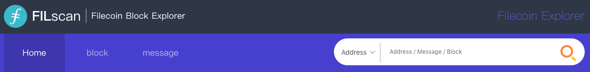
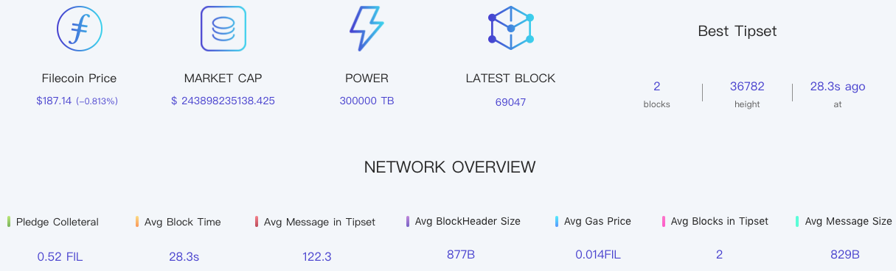
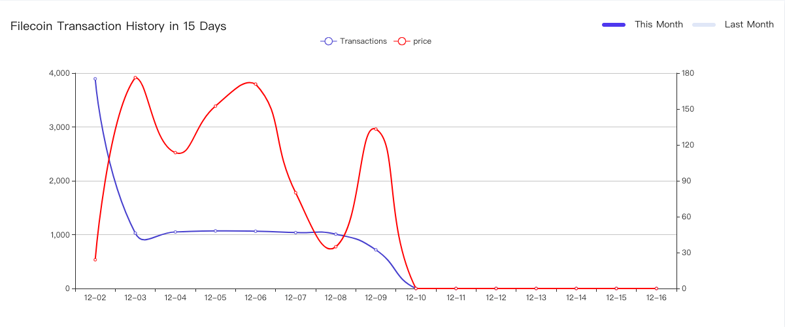
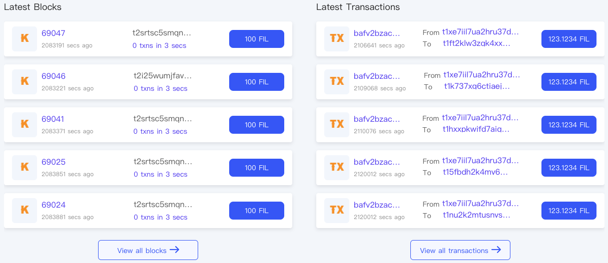
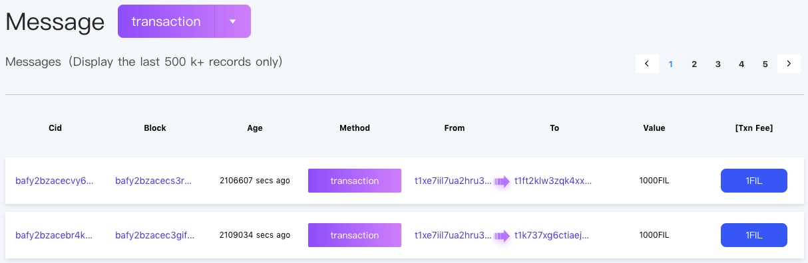
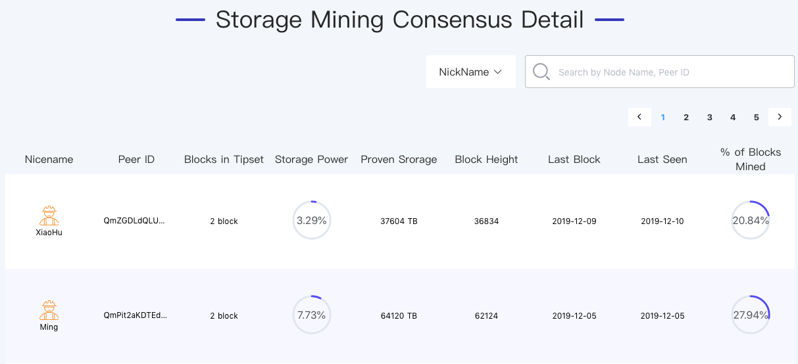
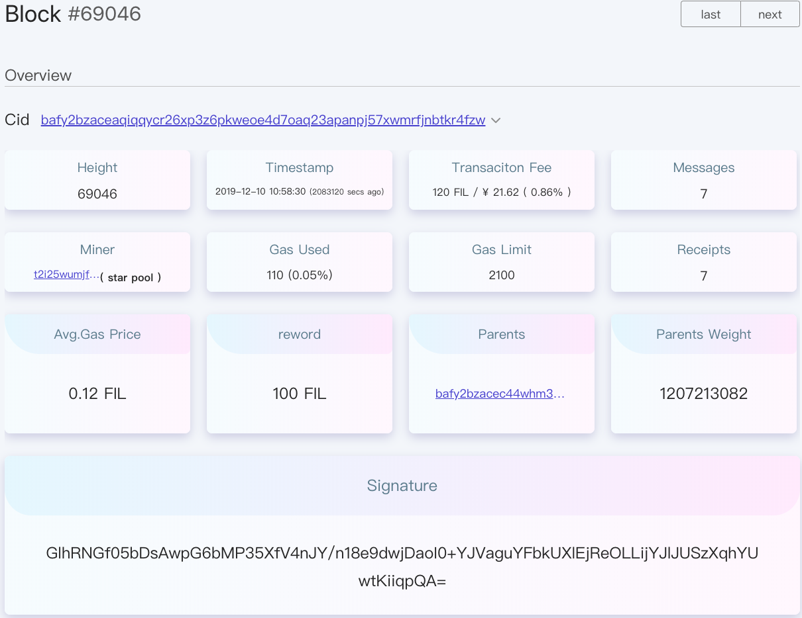
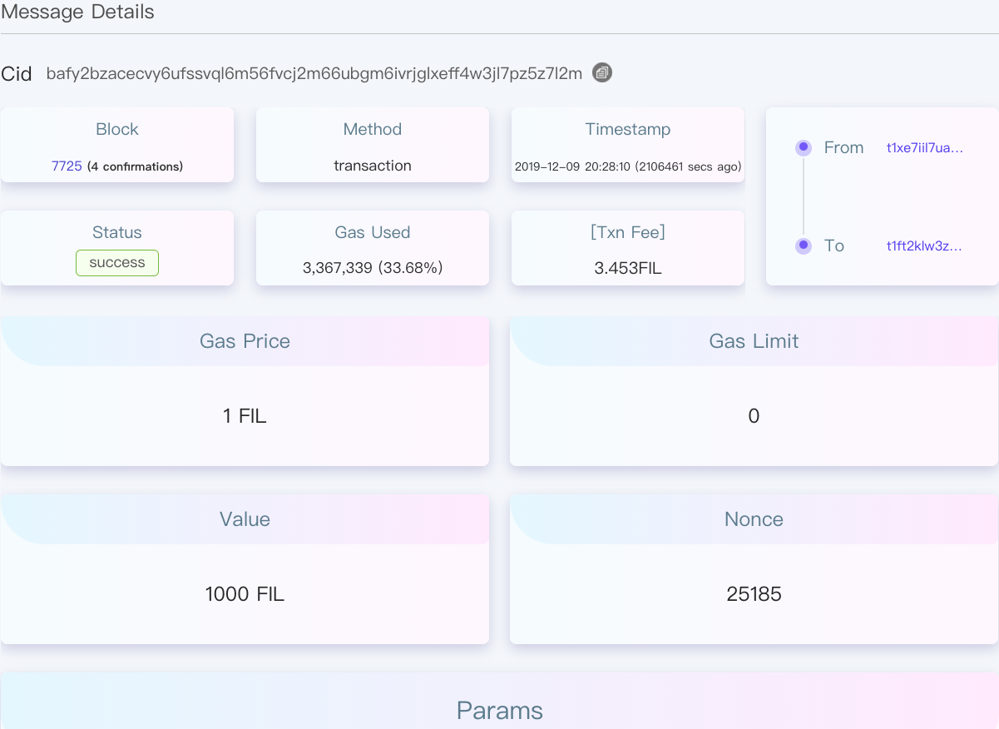
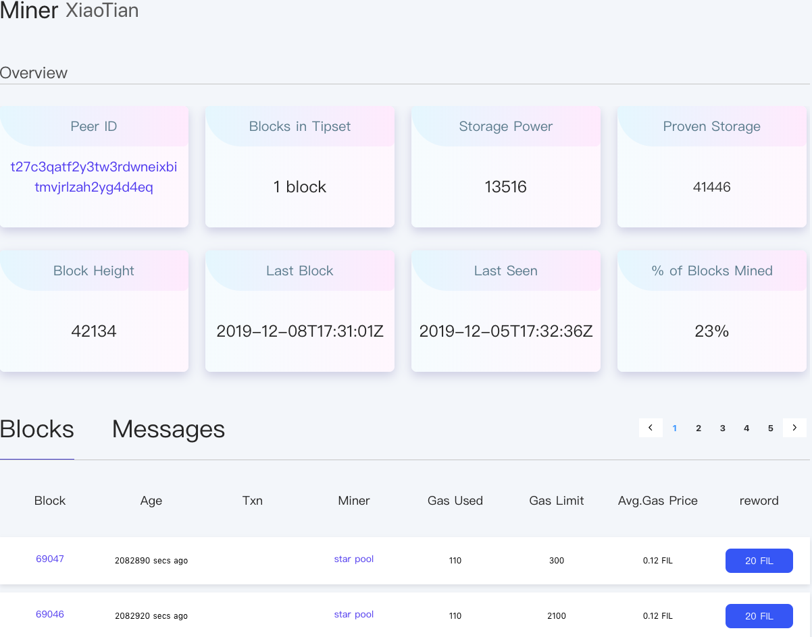

# Open Grant Proposal: `Filecoin Block Explorer`

**Name of Project:** &nbsp;&nbsp;FILscan

**RFP Category:** &nbsp;&nbsp;app-dev

**Proposer:** &nbsp;&nbsp;[@IPFSUNION](https://www.ipfsunion.cn/)

**Do you agree to open source all work you do on behalf of this RFP and dual-licenses under MIT and APACHE2 licenses?:**
&nbsp;&nbsp;"Yes"

# Project Description

With the Filecoin's major network coming online soon, our team is working on the development of block explorer for 
Filecoin network called FILscan out of optimistic about the future of Filecoin, aiming to make a fully funtional, 
interactive and friendly service for the public.

Our technical team had a most fully understanding of the filecoin specification and implementation after reading through
the Filecoin specification and studying the source code of lotus and go-filecoin. FILscan use the official lotus and 
go-filecoin command to synchronize all data on the chain in real time and write into database. 

We resolutely adopt ElasticSearch for real-time data analysis, built es index to provide search service for the block, 
message, miner and so on. By that, we can partition documents into different containers or shards, which can be stored 
on a single node or in multiple nodes.

We plan to release the version V1.0 in March next year and by then our goal will be to weekly release new version. 
We're excited to show off some of the features that FILscan has below to offer below!

# Deliverables

## Value

- Detailed APIs and codebase.
- Professional technical and operations teams
- Real-time updates based on changes on the chain
- Use ElasticSearch engine to hide the complexity of distributed systems
  - Partitioning documents into different containers or shards
  - Balancing these shards across the nodes in cluster to spread the indexing and search load
  - Duplicating each shard to provide redundant copies
  - Routing requests from any node in the cluster to the nodes
  - Seamlessly integrating new nodes as the cluster grows or redistributing shards
- Good adaptation of mobile terminal and code reuse through REM

## Data to display
FIlscan will most often be used by Filecoin developers, token holders, clients, and miners. Based on the analysis of 
user needs, we would mainly implement the following function:

- Allow users to search the details of block, message and miner by blockCid, messageCid, address, or nickname.

- Show the statistical data rendered in the view

- Show recent transaction history in the form of curve diagram

- Show latest blocks and transactions 

 
- Show the list of message

- Show the list of miner

 
- Show the details of block

- Show the details of message

- Show the details of miner

- Real-time updates to the date got from the chain

You will be able to see the block confirmation process in real time without wasting time waiting and constantly 
refreshing. All content from blocks, transactions, balances, and token transfers will be displayed in real time. 
Also you can directly on your account page to view the transaction records and balances in real time once the 
block is updated.

Our block explorer website would be hosted on github, you can look over our github repository to 
read the source code. 

# Our Team

## Team Members

- BiSheng Mao : Lead of FILscan
- WenYi Li : Technical Lead of FILscan
- ZhaoMing Wang : Project Manager
- Huan Shen : Filecoin Engineer and Researcher
- Tao OuYang : UI Designer
- Qi Zhang : UI & UE

## Team Member LinkedIn Profiles

- https://github.com/maobisheng (personal)
- https://github.com/XQYCHJ (personal)
- https://www.linkedin.com/feed/?trk=onboarding-landing

## Relevant Experience

IPFSUNION is a team focused on the global ecological environment construction of IPFS and Filecoin. We have been 
focusing on Filecoin's mining testing, spec studies, problem submission, and code contributions. In the near future, 
our goal is to become a major player in Web3.0, providing users with valuable storage and retrieval services. We will
make different layouts according to the development stage of filecoin. 

# Milestones & Funding

Total Funding Amount: $1500

Milestone: 

| Milestone No. | Milestone Description | Funding | Estimated Timeframe |
| --- | --- | --- | --- |
| 1 | High-fidelity design mockups, running staging site with some UI elements implemented | $400 | 2 weeks |
| 2 | Completed implementation of block explorer | $800 | 4 weeks |
| 3 | All project deliverables are completed and added to the [Filecoin Shipyard](https://github.com/filecoin-shipyard) (website, documentation, codebase) | $300 | 2 weeks |

As far, we have almost had finished Milestone 1&2. However, there 
are still some remaining issues that may require some modifications to the lotus source code. We would constantly pay 
attention to the lotus updates in the code repository and make changes accordingly. 

 
