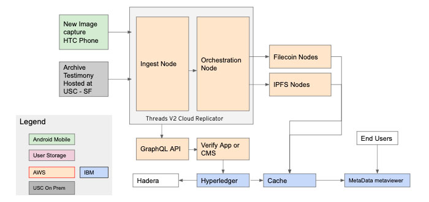

# Open Grant Proposal: `Starling (Verify)`

**Starling (Verify):**

**Proposal Category:** `app-dev`

**Proposer:** `hala-systems`

**Do you agree to open source all work you do on behalf of this RFP and dual-license under MIT and APACHE2 licenses?:** Yes

# Project Description

Please describe exactly what you are planning to build. Make sure to include the following:

The Starling Framework for Data Integrity has three modules: capture, storage and verification. With this grant we propose to complete the third module, verify, to allow researchers to validate and publish data with end-to-end features:

- *Link*
  - Use a Textile Threads V2 Cloud Replicator to syndicate various metadata elements (including storage hashes from IPFS and proofs from Filecoin) into a graphQL database, establish relationships between these elements and their referent objects (pictures, video and text).
- *Verify*
  - Allow administrators to assign various verification tasks to users, who review the submitted data and create attestations on the validity of the data.
- *Add to ledger*
  - Publish all CIDs, metadata and attestations to a Hyperledger Fabric ledger and backed on the Hadera hashgraph.
- *Query*
  - Provide endpoints that allow users to retrieve the data.
- *Visualize*
  - Create a lightweight web app to view the full ledger record and visualize key metadata on maps and the Filecoin Explorer and new AE Explorer.

By building the Verify module we complete the Starling Framework signal flow and allow organizations to publish the data and present the records of provenance, specifically the IPFS and Filecoin storage, in a clear and intuitive UX.

Starling represents a ground-breaking methodology in the fight against the spread of misinformation and deep fakes by providing open source tools, best practices, and case studies that serve to better capture, store and verify data, ultimately helping to reduce information uncertainty in digital media. It is the first project of its kind to create not only a set of combined tools designed to tackle misinformation, but also to build an ethical framework around technology. With applications across news media, historical preservation, and documentation of ongoing crisis and conflicts, the potential use cases for the Starling Framework are numerous.

## Value

- *What are the benefits to getting this right?*
  - We make data stored on Filecoin accessible and graphically visualize Filecoin’s extensive fixty features in context with other key metadata.
- *What are the risks if you don't get it right?*
  - Users may yet be confused by Filecoin’s underlying proofs and may be less motivated to use the system if performance of the module is sluggish.
- *What are the risks that will make executing on this project difficult?*
  - The Verify module requires the integration of several systems, each with their performance limitations. The biggest risk is that optimizing performance may be prohibitively expensive and may have dependencies on underlying systems (including Filecoin) that are not yet mature.

## Deliverables

- *Ingest API*
  - A documented API that links a Filecoin and IPFS CIDs to a file’s metadata elements in a graphQL API.
- *Ledger API*
  - A documented API that publishes all CIDs, metadata and attestations to a Hyperledger Fabric ledger database backed by the Hadera Consensus Service.
- *Query API*
  - A documented API that allows users to query data.
- *Manager (web app)*
  - A web app built that includes inbox and task interfaces. (see [wireframe screencast](https://drive.google.com/open?id=1EBADX1D91SAP0TGCZSao91_1VAcgkfob).)
- *Viewer (web app)*
  - A metadata viewer web app that visualizes key metadata (see [wireframe screencast](https://drive.google.com/open?id=1qRHZOgHWjQuzQ1pqErxDfTWyI-7vtHXm)) and the [Filecoin Explorer](https://explorer-avis.kittyhawk.wtf/blocks/bafy2bzaceb345ojzkoo57guld5gozrrnsmpdrt7qs5yfa36ewchonaaisyo54) and new [AE Explorer.](https://filecoin-lotus-explorer.herokuapp.com/)

## Development Roadmap

|    # | Functionality                                                                                                                                                                                                                                                                                                                                                                                                                                                                                                                                        | People | Funding Required         | Date           |
| ---: | :--------------------------------------------------------------------------------------------------------------------------------------------------------------------------------------------------------------------------------------------------------------------------------------------------------------------------------------------------------------------------------------------------------------------------------------------------------------------------------------------------------------------------------------------------- | :----: | ------------------------ | -------------- |
|    1 | <ul><li>Ledger API</li><ul><li>Hyperledger integration</li><li>Hedera Consensus Service integration</li><li>Display results in Insight </li></ul></ul>                                                                                                                                                                                                                                                                                                                                                                                               |   10   | Internal                 | March 13, 2020 |
|    2 | <ul><li>Ingest API</li><ul><li>Filecoin integration</li><li>IPFS integration</li></ul></ul>                                                                                                                                                                                                                                                                                                                                                                                                                                                          |   4    | Internal                 | April 20, 2020 |
|    3 | <ul><li>Viewer (v0.0a)</li><ul><li>User management<ul><li>Authentication</li><ul><li>OAuth</li></li></ul><li>Authorization</li><ul><li>Database</li></ul></li></ul><li>Display image uploads</li><ul><li>Show associated location</li><li>Show timestamp</li><li>Show all related metadata</li><li>Show related events</li></ul><li>Display text-based input</li><ul><li>Show associated location</li><li>Show timestamp</li><li>Show related events</li></ul><li>Display hash related to:</li><ul><li>Images</li><li>Text input</li></ul></ul></ul> |   10   | $19, 680.00 (+ internal) | April 20, 2020 |
|    4 | <ul><li>Manager (v0.0a)</li><ul><li>User management<ul><li>Authentication</li><ul><li>OAuth</li></li></ul><li>Authorization</li><ul><li>Database</li></ul></li></ul><li>Show pending image uploads</li><li>Show pending text inputs</li><li>Approve incoming events</li></ul><li>API documentation</li><ul><li>Ledger API</li><li>Ingest API</li></ul></ul>                                                                                                                                                                                          |   10   | $4,320.00 (+ internal)   | May 18, 2020   |
|    5 | <ul><li>Viewer (v0.0b)</li><ul><li>User interface refinements</li><li>Stability improvements</li><li>User management refinements</li></ul><li>Open source media integration (alpha)</li><ul><li>Define hooks for allowing scraped data to enter the system</li><li>Integrate with Ledget API</li></ul><li>Viewer documentation</li></ul>                                                                                                                                                                                                             |   10   | $1,920 (+ internal)      | June 8, 2020   |
|    6 | <ul><li>Manager (v0.0b)</li><ul><li>User interface refinements</li></ul><li>Open source media integration (beta)</li><ul><li>Show correlated open media events associated with submitted data</li><li>Allow correlated data to be disassociated from events</li><li>Allow authorized users to adjust open source trust score</li></ul><li>Query API</li></ul>                                                                                                                                                                                        |   10   | $1,200 (+ internal)      | July 6, 2020   |
|    7 | <ul><li>Viewer (v1.0)</li><ul><li>User interface refinements</li><li>QA</li></ul></ul>                                                                                                                                                                                                                                                                                                                                                                                                                                                               |   4    | Internal                 | September 2020 |
|    8 | <ul><li>Manager (v1.0)</li><ul><li>User interface refinements</li><li>QA</li></ul></ul>                                                                                                                                                                                                                                                                                                                                                                                                                                                              |   4    | Internal                 | October 2020   |
|      | *Total*                                                                                                                                                                                                                                                                                                                                                                                                                                                                                                                                              |        | $30,000                  |                |

## Total Budget Requested

USD $30,000

This grant will be used to help fund the overall development. Specifically, it will be used to fund the three Software Engineers focusing on "front end" for the first three months of the project, as outlined in the budget.

- [Budget is here](https://drive.google.com/open?id=1uvbbJW9hYpg-bLn8T3i2xnBHYU8weqiX)

## Maintenance and Upgrade Plans

Once the project has reached a first official release, Hala Systems will take lead on handling bug fixes and security-based maintenance for a span of six months. Since the project will be open source, other teams can offer input and support as the project continues to mature.

Feature requests and suggestions (upgrades) will be managed through Github Issues. We expect these to be implemented based on feedback from real-world usage and and community response through Github.

# Team

## Team Members

**John Jaeger, Co-Founder & CEO:** After spending three years working on conflict, stabilization, and countering violent extremism, John founded Hala to use technology in order to fill a critical global need to help provide security and trauma reduction for the world's most vulnerable populations. He helps lead all Hala Systems initiatives.

**Dave Levin, Co-Founder & COO:** Dave is an expert in technology for development and social entrepreneurship, with 15 years of experience developing social impact initiatives globally. He helps lead all Hala Systems initiatives.

**Greg Ipp, Director of Engineering:** With over 25 years of experience in the technology sector, Greg began developing the prototype for a civilian protection system with Hala Systems in 2016; his focus remains on technology projects that have a strong positive social impact. He provides broad oversight on Starling technology.

**Thomas Simpson, Senior Product Manager:** Thomas has over 20 years of experience in product development, holds a Bachelor’s in Computer and Information Science and a Master’s in Engineering Computer Science, and has been published in SigVis, SigGraph, and The Linux Journal. His role with Starling focuses on technology-related product development.

**Bellamy Hanoian, Lead Software Engineer:** Bellamy is a software engineer specializing in digital media. Her past work spans analytics, recommendation algorithms, DevOps, and engineering management.

**Jimmy Stevenson, Software Engineer:** Jimmy is a software engineer, specializing in designing, developing, and deploying serverless systems. He has previously built robust and high volume systems for companies such as Southwest Airlines, Nike, and Hobsons.

**Jonathan Dotan, Starling Framework Founder:** Jonathan Dotan is a Fellow at Stanford’s Center for Blockchain Research and the Stanford Compression Forum. He researches and lectures on the applied strategy and policy for a decentralized Internet and co-founded the Starling Initiative. He will lead with Hala the strategy and architecture design of the Verify module to ensure it will meet Hala’s immediate requirements while still being a generalized solution that can be useful for partners at the USC Shoah Foundation and others.

## Team Member LinkedIn Profiles

- [John Jaeger](https://www.linkedin.com/in/john-jaeger-06936b/)
- [Dave Levin](https://www.linkedin.com/in/dave-levin-36a3721/)
- [Greg Ipp](https://www.linkedin.com/in/gregipp/)
- [Thomas Simpson](https://www.linkedin.com/in/thomas-simpson-7ab9bb7/)
- [Bellamy Hanoian](https://www.linkedin.com/in/bellamy-smith-hanoian-669a6a66/)
- [Jimmy Stevenson](https://www.linkedin.com/in/ja-stevenson/)

## Team Website

[https://halasystems.com/](https://halasystems.com/)

## Relevant Experience

Please describe (in words) your team's relevant experience, and why you think you are the right team to build this project. You can cite your team's prior experience in similar domains, doing similar dev work, individual team members' backgrounds, etc.

Hala Systems completed a similar proof of concept with Consensys in September 2018 of a data visualizer and DTL publishing mechanism. See a [detailed post](https://media.consensys.net/holding-war-criminals-accountable-with-the-ethereum-blockchain-6b12471a7cdd) on the ConsenSys Social Impact blog.

**Background**
Hala Systems saves lives in conflict zones. Hala created an early warning system for airstrikes against civilians in Syria that reaches 2.3 million civilians, has saved hundreds of lives, and has prevented thousands of injuries. Sentry Syria ("Al-Rased"), as the system is called, was developed with and for the Nobel-nominated White Helmets and provides 7-10 minutes of warning on average. Sentry reduces casualties from airstrikes by an estimated 20%-30%. Furthermore, with over 180,000 documented aircraft observations, Hala has the most comprehensive picture of the air war over Western Syria that exists outside of a classified environment.

Hala’s founders are a former US diplomat who specialized in stabilization in Syria and a former McKinsey consultant specializing in tech-driven social enterprise – each of whom has more than 15 years of experience. The team includes four PhDs, and members hail from institutions such as Stanford, Harvard, Yale, Princeton, Oxford, Cambridge, Imperial, Wharton, Amazon, Airbnb, Deloitte, MIT-Lincoln Laboratory, the UN, DFID, Oxfam, and the World Bank. Hala’s staff operate from Turkey, Portugal, the UK, Germany, the US, and Canada. Teams include: Software Engineering, Hardware Engineering, Product Management, Data Science & AI, Field Operations, and Finance & Business Operations. Team members are 60% women and people of color; 50% from developing countries; 40% technical staff (e.g., engineers, data scientists, product development); 30% refugee/asylee; and 7% LGBTQ.

Sentry has five components:

1. Sensing: The system is built on three pillars for gathering information: i) trained human observers who use a secure, Hala-produced mobile app to report aircraft observations; ii) news and social media gathered via machine-learning (ML) algorithms; and iii) remote sensors that detect the sounds of aircraft.
2. Preserving: Data is hashed to provide an immutable record for war crimes investigators.
3. Validating: We validate data by vetting and training observers, monitoring their performance, and cross referencing information from independent sources.
4. Analyzing: We use ML algorithms to determine relevant data points and predict threatened areas in real-time.
5. Sharing: Within seconds, Sentry sends warnings to civilians via air raid sirens, visual warning systems in medical facilities, social media (Telegram, Facebook Messenger bot), radio, and audible messages for the visually impaired. Hala works with 47 members of the White Helmets to ensure warnings reach women, children, hospitals, internally displaced persons camps, besieged communities, and first responders.

Hala designed and built IoT devices to connect over 100 of the White Helmets’ air raid sirens to the internet, enabling automatic activation. Moreover, Hala provided the White Helmets with IoT devices to activate sirens manually and remotely. This allows them to deactivate the sirens to control for warning fatigue, and to activate the sirens during ground attacks (rockets, mortars). Hundreds of Hala-built IoT devices also connect 60 medical facilities to Sentry via warning lights, often activated in buildings located deep underground. We’re now installing visual warning systems in 60 additional medical facilities.

Furthermore, Hala created another product called Insight to share data with foreign ministries and UN agencies seeking to build peace, counter disinformation, and bring accountability for war crimes. Insight is a real-time data visualization and analytics portal which maps the data from Hala’s sensors, human observers, and open source extraction tools. Users can extract detailed reports like high casualty events or recent increases in attacks.

## Team code repositories

No open source repositories yet.

Data exploration and visualization tools

- [https://halainsight.com/](https://halainsight.com/)
  - Access available upon request
- Applications for early warnings
  - Privately distributed via Google Play Store
  - Demo videos are available upon request
- Data reporting applications
  - Examples of output available upon request

# Additional Information

Hala Systems saves lives in conflict zones via Sentry. Sentry is a platform for generating credible ground truth in real time in the most dangerous places on Earth. It employs a variety of technologies, including the internet of things (IoT), artificial intelligence (AI), remote sensing, and distributed ledger technologies. The multi-purpose platform is designed to address many of the challenges faced by the two billion people living in countries affected by fragility, conflict, and violence: civilian casualties, atrocities, and trauma; documentation of war crimes; emergency response coordination; ceasefire monitoring and peacebuilding; explosive remnants of war; disinformation; and countering violent extremism.

Hala has 44 staff members and 70+ part-time partners working on the ground in Syria and Yemen. Hala’s advisors include Sir Stephen O’Brien, KBE, former UN Under-Secretary-General for Humanitarian Affairs & Emergency Relief Coordinator (Head of UN OCHA); US Ambassador Rick Barton, former Assistant Secretary of State for the Bureau of Conflict and Stabilization Operations and Deputy High Commissioner of the UN Refugee Agency (UNHCHR); and UK Ambassador Thomas Fletcher, CMG, former Ambassador to Lebanon and Private Secretary for Foreign Affairs for three UK Prime Ministers.

The company's work has been supported with nearly $20 million of financing from the governments of Germany, Canada, the Netherlands, the UK, Denmark, and the United States; the United Nations and the Organization for the Prohibition of Chemical Weapons; and investors such as Mark Cuban, Frank Giustra (Founder of Lions Gate Entertainment), Laurie Michaels, and Dr. Evan Malone. Hala's life-saving initiative has been covered widely in the media, such as [Wired](https://www.wired.com/story/syria-civil-war-hala-sentry/), [CNN](https://www.cnn.com/videos/world/2018/09/26/app-warns-of-airstrikes-syria-damon-pkg-vpx.cnn), [Washington Post](https://www.washingtonpost.com/world/the-secret-app-that-gives-syrian-civilians-minutes-to-escape-airstrikes/2018/08/17/e91e66be-9cbf-11e8-b55e-5002300ef004_story.html?noredirect=on&utm_term=.3a9628bc1856), [BBC](https://www.bbc.co.uk/programmes/p06hqdfh), [CBS News](https://www.cbsnews.com/news/two-americans-develop-hala-systems-to-alert-syrians-of-coming-airstrikes/), [Reuters](https://www.reuters.com/article/us-mideast-crisis-syria-warning/air-strike-warning-app-helps-syrians-dodge-death-from-the-skies-idUSKCN1LT2HV), [The Times](https://www.thetimes.co.uk/article/british-aid-cash-to-save-syrians-from-airstrikes-m328xbnvr), and [Daily Telegraph](https://www.telegraph.co.uk/news/2018/08/17/social-media-warning-system-saving-lives-syria/). The most poignant material, however, is this [2-minute video testimonial of a woman who escaped harm along with her grandchildren](https://hala.link/sentry-tm1).

Hala won the C$1 million Humanitarian Grand Challenge Award in 2019 from the governments of Canada, the US, the UK, and the Netherlands. The company is one of 35 global finalists in the Extreme Tech Challenge of 2020, organized by Bill Tai, Samsung, Cisco, Ford, and other leading corporations. Hala was one of 16 companies chosen for support by Unreasonable Group and Johnson & Johnson in the Unreasonable Goals program, which amplifies the work of entrepreneurs advancing the Sustainable Development Goals. Additionally, Hala is a graduate of the Creative Destruction Lab (University of Toronto), one of the world’s leading accelerators for AI startups, as well as the PeaceTech Accelerator of the US Institute of Peace. Finally, Hala was selected to be a portfolio company of The Conduit Connect and Singularity University (SU), and the company won SU’s Global Grand Challenge Award for Security.
