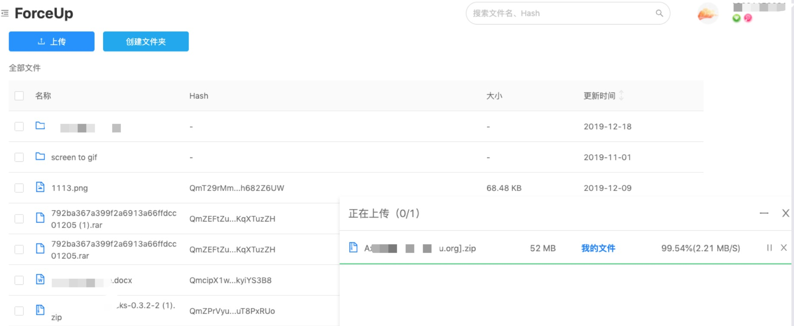

# RFP Proposal: Simple Storage webapps
**Name of Project:** `FilClient`

**Link to RFP:** [Simple Storage webapps](https://github.com/filecoin-project/devgrants/blob/master/rfps/new-wave-3-rfps.md#simple-storage-webapps).

**RFP Category:**  `app-dev`

**Proposer:**  [IPFS-FORCE](https://github.com/orgs/ipfs-force-community)
 
**Do you agree to open source all work you do on behalf of this RFP and dual-license under MIT and APACHE2 licenses?:** `Yes`

# Project Description

We are IPFS-Force team from China with several years' development experience in Blockchain Industry and deep understanding of Blockchain Activities and Actors. With solid experience, we are capable to dive and analyze multidimensional data from blockchain raw data and displayed in creative visualization.

FilClient is a user-friendly light webclient, which you can complete data storage transactions on this client (if lotus has completed this part of the function).We already have an ipfs-based client [forceup](http://www.forceup.cn/#/login) that has been online, which provides us valuable experience, and we are sure to complete this challenge.

## Deliverables

We plan to develop API service using Golang. User use friendly frontend view to select miner, make deal, and send retrieve data.

  

FilClient features:
- Choose an ask (or list of miners ask).
- Connect to the miner.
- Make a storage deal.
- Payment.
- Send and Retrieve data from miner.

## Development Roadmap
### Milestone 1

1. UI/UX Design: include miner view ,transfer view, payment view and Retrieve data view, etc.
2. Solution Research and Design: Interface, Message Data Struct, Business Process

Resources Requirement:
- 1 Arch, 0.5 PO
- 2 weeks

### Milestone 2

1. Implementation: All function in [FilClient features](##-Deliverables)
2. Documentation: User Guide

Resources Requirement:
- 2 Dev, 1 PM
- 4 weeks

*The project progress depends on the completion of the Lotus.*

## Total Budget Requested

Total Budget: $20,200.00

| Role | Rate/Hr | HC | Man-Hour | Man-Week | Price |
|------|--------|----|------------|------------|------|
| Arch | $80 | 1 | 40 | 1 | $3,200.00 |
| PO | $50 | 1 | 20 | 1 | $1,000.00 |
| Dev | $50 | 2 | 160 | 4 | $16,000.00 |

Budget include PM & UX

## Maintenance and Upgrade Plans
Adjust Filecoin interface on demand

# Team

IPFS-Force, China Top Decentralized Storage Technology Company.

## Team Members

- Architect           Steven Li
- Project Manager     Katrina Liu
- Product Owner        Yu Da 
- Full-stack Dev       Feng Li
- Backend Dev        Caesar Wang

## Team Member LinkedIn Profiles

Steven Li: [https://www.linkedin.com/in/xinlee/](https://www.linkedin.com/in/xinlee/)

Katrina Liu: [https://www.linkedin.com/in/katrina-liu-a16a84127](https://www.linkedin.com/in/katrina-liu-a16a84127)

Yu Da: [https://www.linkedin.com/in/宇-达-219519103/](https://www.linkedin.com/in/)

Feng Li: [https://www.linkedin.com/in/felixlee20190908](https://www.linkedin.com/in/felixlee20190908)

Caesar Wang: [https://www.linkedin.com/in/麟-王-97a836149/](https://www.linkedin.com/in/%E9%BA%9F-%E7%8E%8B-97a836149/)

## Team Website

 [https://ipfser.org](https://ipfser.org)

## Relevant Experience

Our team constantly demonstrate the professionalism on the research of protocol and distributed storage system and actively participate in several Lab seminars of FIL ecosystem. Since Feb 2019, when the Filecoin is open-sourced, several team engineers have been diving into Filecoin studying, coding, and eco-system development. The team have contributed code for several projects in go-filecoin program with tens of PRs, while we pro-actively participate in devnet testing, issues submitting, and discussion of design. IPFS-Force is one of the most active communities in Filecoin eco-system everybody could see from github and slack channel. We have developed several libs and tools which could support FilScan development, that's why the whole schedule could be defined tightly. In addition, our Arch and Devs have seasoned experience of Blockchain and Storage projects, such as High-density Cloud Object Storage, Ethereum, Ulord, aside from Filecoin and IPFS.

## Team code repositories
Code Base:[IPFS-FORCE](https://github.com/ipfs-force-community)

Steven Li:[https://github.com/steven004](https://github.com/steven004)

Caesar Wang:[https://github.com/dtynn](https://github.com/dtynn)
