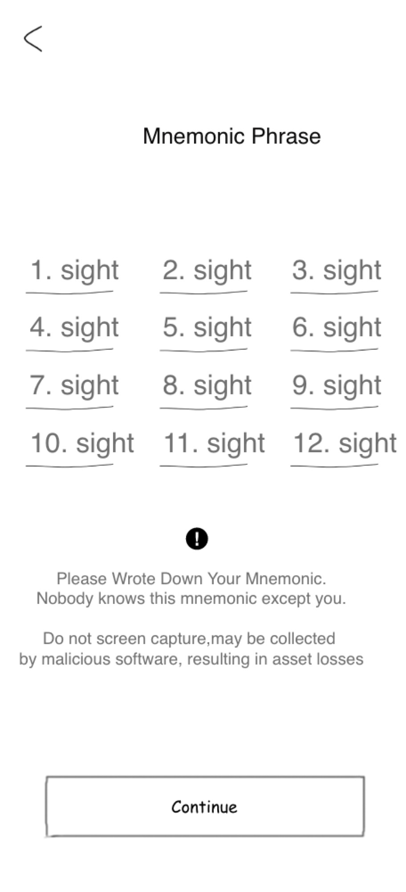
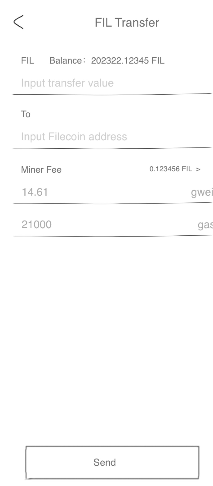

# RFP Proposal: Filecoin Wallet
**Name of Project:** `Filecoin Wallet & Tools`

**Link to RFP:** [rfp-filecoin-wallets.md](https://github.com/filecoin-project/devgrants/blob/master/rfps/rfp-filecoin-wallets.md).

**RFP Category:**  `app-dev`, `devtools-libraries`

**Proposer:**  [IPFS-FORCE](https://github.com/orgs/ipfs-force-community)
 
**Do you agree to open source all work you do on behalf of this RFP and dual-license under MIT and APACHE2 licenses?:** `Yes`

# Project Description

Hi Labs, we are IPFS-Force team from China with several years' development experience in Blockchain Industry and deep understanding of Blockchain Activities and Actors. With solid experience, we are capable to dive and analyze multidimensional data from blockchain raw data and displayed in creative visualization.

Filecoin-Wallet is a secure, convenient, professional and web-based Filecoin wallet, that implements FIL transfer function and display the transaction records. For wallet’s security, it will be capable to generate random mnemonics and private key with import and export function. To avoid data leakage and transaction security, the private key will be stored locally.

## Deliverables
For `Track1`:

We plan to develop cross-platform wallet service using Golang. The wallet is run at local that can connect any filecoin node by socket (currently support the lotus node), and user can use wallet services through a browser.

Wallet features:
- HD wallet that support both secp256k1 and BLS multiple addresses from a mnemonic seed.
- Safe and friendly private key management: use AES to encrypt private key which can be  import and export , as welle as mnemonic .
- Support transfer, balance inquiry, transaction status inquiry, transaction records list.
- Support node management for easy access to multiple nodes.

For `Track2`:

Tool: Filecoin wallet  js package

This package provides HD wallet functions based on secp256k1 and BLS, make it easy for developers to customize their wallet functions with this package.

Features:
- Support HD key generation of secp256k1 and BLS
- Support for constructing transfer messages
- Support message secp256k1 or BLS signature

## Development Roadmap
### Milestone 1

1. UI/UX Design: include mnemonic view ,transfer view, balance and transfer records view, etc.
2. Solution Research and Design: Interface, Message Data Struct, Business Process
3. Design Doc

Resources Requirement:
- 1 Arch, 0.5 PO
- 2 weeks

### Milestone 2

1. Implementation: npm js package which can provide  mnemonic, transfer message and sign function
2. Documentation: Project Management Document, User Guide

Resources Requirement:
- 1 Dev, 1 PM
- 1 weeks

### Milestone 3

1. Implementation:A full function Browser Filecoin-wallet, include mnemonic view ,import and export private key, transfer view, balance and transfer records view.
    - Design page examples: 1) mnemonic phases page; 2) wallet page; 3) transfer page

  
   
  

Resources Requirement:
- 1 Dev, 1 PM
- 2 weeks

## Total Budget Requested

Total Budget: $18,400.00

| Role | Rate/Hr | HC | Man-Hour | Man-Week | Price |
|------|--------|----|------------|------------|------|
| Arch | $80 | 1 | 40 | 1 | $3,200.00 |
| PM | $60 | 1 | 80 | 2 | $4,800.00 |
| PO | $50 | 1 | 40 | 1 | $2,000.00 |
| Full-stack Dev | $70 | 1 | 120 | 3 | $8,400.00 |

## Maintenance and Upgrade Plans

1. Adjust Filecoin interface on demand
2. Website Maintenance
   - Bug Fixing on demand
   - Maintenance including domain name, security certificate and 1-year website service operation
3. Upgrade Plan
   - Quarterly upgrade version

# Team

IPFS-Force, China Top Decentralized Storage Technology Company.

## Team Members

- Architect           Steven Li
- Project Manager     Katrina Liu
- Product Owner        Yu Da 
- Full-stack Dev: Feng Li
- Backend Dev        Caesar Wang

## Team Member LinkedIn Profiles

Steven Li: [https://www.linkedin.com/in/xinlee/](https://www.linkedin.com/in/xinlee/)

Katrina Liu: [https://www.linkedin.com/in/katrina-liu-a16a84127](https://www.linkedin.com/in/katrina-liu-a16a84127)

Yu Da: [https://www.linkedin.com/in/宇-达-219519103/](https://www.linkedin.com/in/)

Feng Li: [https://www.linkedin.com/in/felixlee20190908](https://www.linkedin.com/in/felixlee20190908)

Caesar Wang: [https://www.linkedin.com/in/麟-王-97a836149/](https://www.linkedin.com/in/%E9%BA%9F-%E7%8E%8B-97a836149/)

## Team Website

 [https://ipfser.org](https://ipfser.org)

## Relevant Experience

Our team constantly demonstrate the professionalism on the research of protocol and distributed storage system and actively participate in several Lab seminars of FIL ecosystem. Since Feb 2019, when the Filecoin is open-sourced, several team engineers have been diving into Filecoin studying, coding, and eco-system development. The team have contributed code for several projects in go-filecoin program with tens of PRs, while we pro-actively participate in devnet testing, issues submitting, and discussion of design. IPFS-Force is one of the most active communities in Filecoin eco-system everybody could see from github and slack channel. We have developed several libs and tools which could support FilScan development, that's why the whole schedule could be defined tightly. In addition, our Arch and Devs have seasoned experience of Blockchain and Storage projects, such as High-density Cloud Object Storage, Ethereum, Ulord, aside from Filecoin and IPFS.

## Team code repositories

Steven Li:[https://github.com/steven004](https://github.com/steven004)

Caesar Wang:[https://github.com/dtynn](https://github.com/dtynn)
