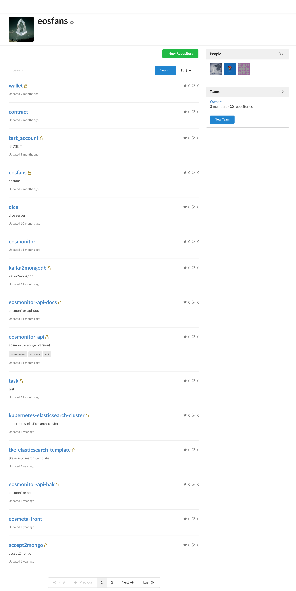
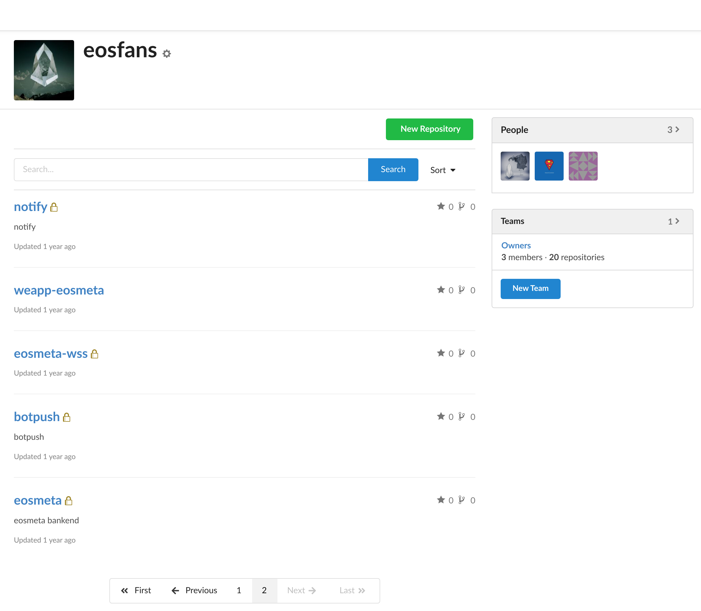
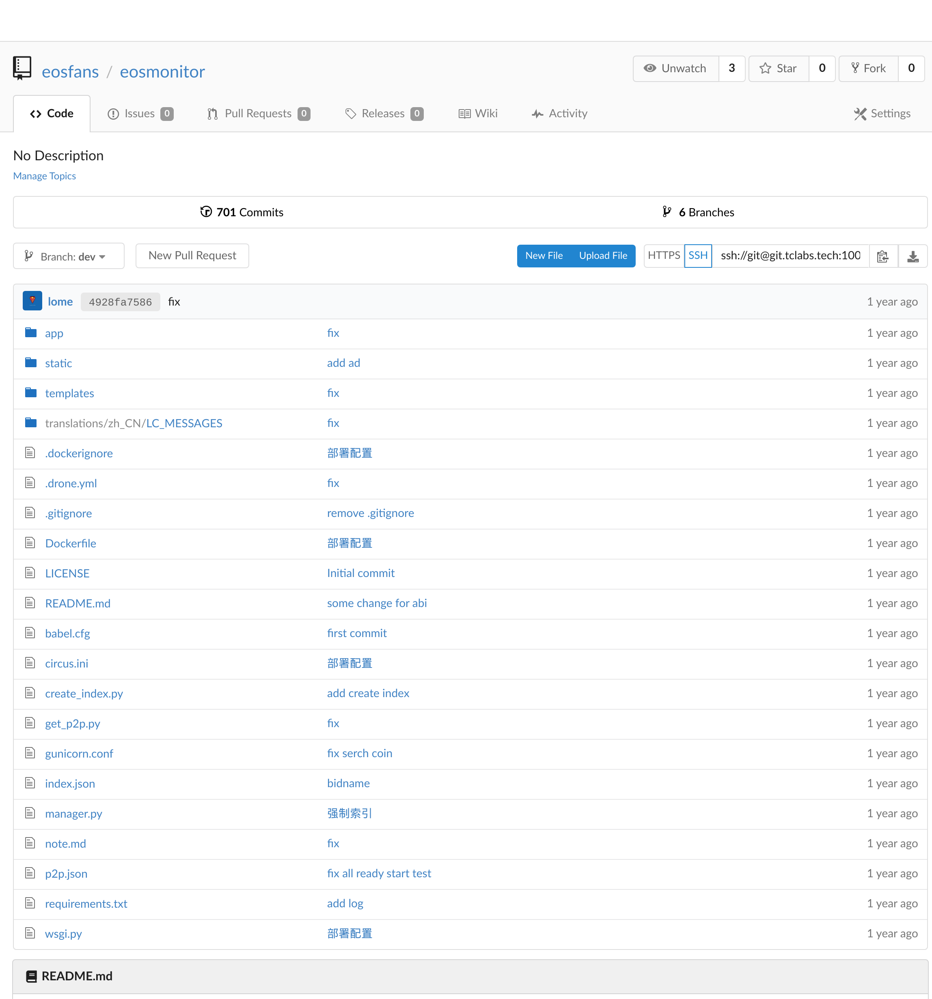
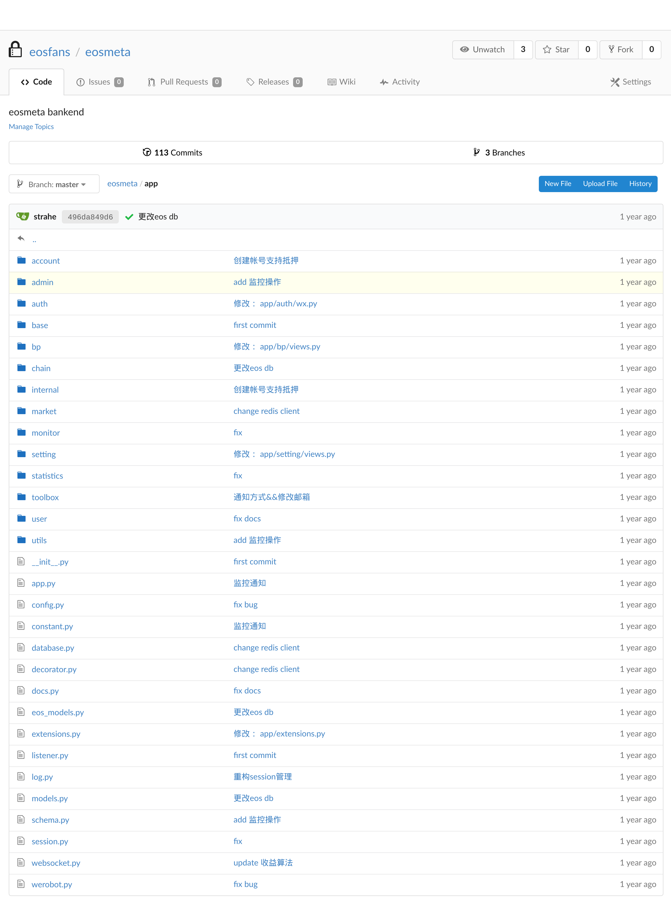

# RFP Proposal: `filemeta.io`

**Name of Project: filemeta.io**

**Link to RFP:[rfp-block-explorer](/rfps/rfp-block-explorer.md)**

**RFP Category:app-dev**

**Proposer:[@strahe](https://github.com/strahe)**

**Do you agree to open source all work you do on behalf of this RFP and dual-license under MIT and APACHE2 licenses?:Yes**

# Project Description

We call the project'filemeta.io'. As most blockchain explorers,'filemeta.io' can display and search most detailed blockchain metrics of Filecoin blockchain,such as Block Data, Deals, Actors,etc.

The performance of current blockchain explorers shows that traditional data storage solution has been adopted extensively in most long run projects with good experience,like `mongodb sharding cluster`, `elasticsearch`.We also agree that there is a big advantage in big data query for using traditional data storage solution rather than standalone HTTP API. Based on this idea, we'll focus on providing more statistical analysis data,better query performance and higher availablity in addition to basical data display and query function of explorers.

In general,`filemeta.io` has advantages of block data storage solution optimized for big data ,more statistical analysis data and higher availablity.

## Deliverables

Final deliverables will include:

* Fully functional block explorer website(Build with `Python3 asyncio` and `Vuejs`).
  * Publicly accessible via `https://`.
  * `Mobile-responsive` and `Real-time` design(Websocks first but compatible with polling mode).
  * Fast to load.
  * Good UE && UI(Will provide a High-fidelity design mockups).
  * Highly available.
* Open-sourced repo for all work on this project.
  * Well-documented.
  * Dual-licensed under MIT and APACHE.
* Backend API documentation(With swagger UI).
* A generic API for querying backend data(Maybe it can be used as a supplement to the Filecoin REST API?).

## Development Roadmap

Milestones:

| No. | Description | Funding | Estimated Timeframe |
| ----------- | ----------- | ----------- | ----------- |
| 1   | Visual design and animation design.    | $5000 | 3 weeks |
| 2   | Block Data storage solution | $20000 | 4 weeks |
| 3   | Completed implementation of block explorer (Backend && Frontend) | $30000 | 8 weeks |
| 4   | Documentation, Testing, Addition to [Filecoin Shipyard](https://github.com/filecoin-shipyard) | $5000 | 2 weeks |
| 5   | Maintenance and Upgrade | $20000 | 1 year |

### Milestone 1 && 2

In fact, we'll carry out Milestone 1 & 2 simultaneously for little correlation between Milestone 1 and 2.Early in the project,we'll follow up the development status of [Filecoin Node](https://github.com/filecoin-project/go-filecoin),especially the API, to adjust the new data storage solution.There may be some changes in the process for that the new [Filecoin REST API](https://docs.google.com/document/d/1ANnTHOU-8612ayvvS7Ru4B1L4voojLE0R0TQ8zF1x5s) is under designing. And we'll try to develop `Filecoin DB Plugin` or `Filecoin kafka Plugin` to import block data into a traditional data cluster or message queue.This part may take a long time for the  importance that the rest parts all depend on it.

When the first part is finished, we'll be able to provide High-fidelity design mockups which involves `Detailed Requirements`. And this one can identify most of the functions and styles. We may have some very minor adjustments.

The first part will be done by one designer while discussed by all the team members.

When the second part is finished,we'll deploy a `Mongodb Sharding Cluster`,and run one or more `Filecoin Node` which has the ability to process data in real time.Depending on the usage scenario,it will import `Filecoin Blockchain Data` into database or message queue in real time,which is still under consideration.

The second part will be done by two backend programmers.

For greater development efficiency,we may not provide hosted front or backend programs during this period.

### Milestone 3

In this period,we'll follow the design plan to complete the development of the front and backend of the explorer.Finally,it will be hosted and the loading speed will be optimized.

According to the schedule,the explorer at this stage will be compatible with Filecoin Beta Testnet or the latest test network at that time.

When this phase is complete,we'll release the Beta version of `filemeta.io` and host it on our severs for `https` access.At this point,we will still accept opinions from community and `Filecoin Team` to optimize and improve `filemma.io` appropriately.

This phase will be done by a frontend programmer and a backend programmer.

### Milestone 4

In this phase,we will complete all the unfinished work of the project,including API documentation,more adequate testing and optimization,adding the codebase to [Filecoin Shipyard](https://github.com/filecoin-shipyard),and so on.

This phase will be done by a frontend programmer and two backend programmers.

### Milestone 5

Taking third party data storage solutions,high availablity and big data architectures for advantages make our backend  much more complicated than other solutions,which may require more used servers and more labor costs.

Over the next year,we will continue to maintain and upgrade the explorer to ensure stable operation.

Our team will be jointly responsible for this phase.

## Total Budget Requested

$80000

## Maintenance and Upgrade Plans

We promise to maintain and upgrade `filemeta.io` for at least 1 year.

In fact,our team plans to join `Filecoin` community full time for developing more applications.If all goes well,we may be able to maintain and develop all the time.

# Team
We are a small entrepreneurial team in China.We joined EOS community with [EOSTEA](https://eostea.io) in November 2017.Since then,we had maintained the largest Chinese developer community of EOS `eosfans.io`. We also developed EOS blockchain explorers,such as `eosmonitor.io`(the first explorer of EOS community) and `eosmeta.io`. We withdrawed from EOS community,and closed `eosmonitor.io` & `eosmeta.io` in October 2018,duing to the complicated relationships in the community and the huge maintenance cost of the project.

 Now,we are eager to join `Filecoin community` at the right time.

## Team Members

- [@strahe](https://github.com/strahe)
- [@lome](https://github.com/Lomect)
- [@aholic](https://github.com/iWtbAbh)
- UI/UE designer

## Team Member LinkedIn Profiles

## Team Website

We don't have a public website right now. But we have used [eostea.io](https://eostes.io) over the past year.

## Relevant Experience

Our team was founded in November 2017. @strahe, with rich work experience in Docker, Kubernetes, Devops,onced worked in [WEDOCTOR](https://linkedin.com/company/wedoctor) as a leader of `Container Team`,while the rest developers in the team also have more than 3 years development experience.

In November 2017,we joined EOS community full time.Since then,we had developed the first blockchain explorer named `eosmonitor.io` and `eosmeta.io`,a real-time statistical and analysis website.Our blockchain explorer has a good user experience and unique metrics for we develop our own`EOS Kafka Plugin`and `EOS MongoDB Plugin`.We also shared a lot of development experiences in the community,including node deployment and operation.In addition,we operated `EOS Party Testnet`,the largest EOS test network in Chinese community at that time.

Some of the work we did last year is here: https://github.com/eostea

most of the work is in our internal git server.Here are some screenshots(For further Information,please contact us.):

## Team code repositories

* https://github.com/eostea

* https://git.tclabs.tech

Most of our  work is in our internal git server,please refer to *Relevant Experience* for further Information.

# Additional Information

EOSIO is a quite complicated blockchain system,and it has something in common with this project,we are confident to finish this project well,owing to our experience in the EOS community over the past year.Also,it's an opportunity for us to join Filecoin community,therefore we'll take it very seriously.

For further Information about our team,please contact a@tclabs.tech.
