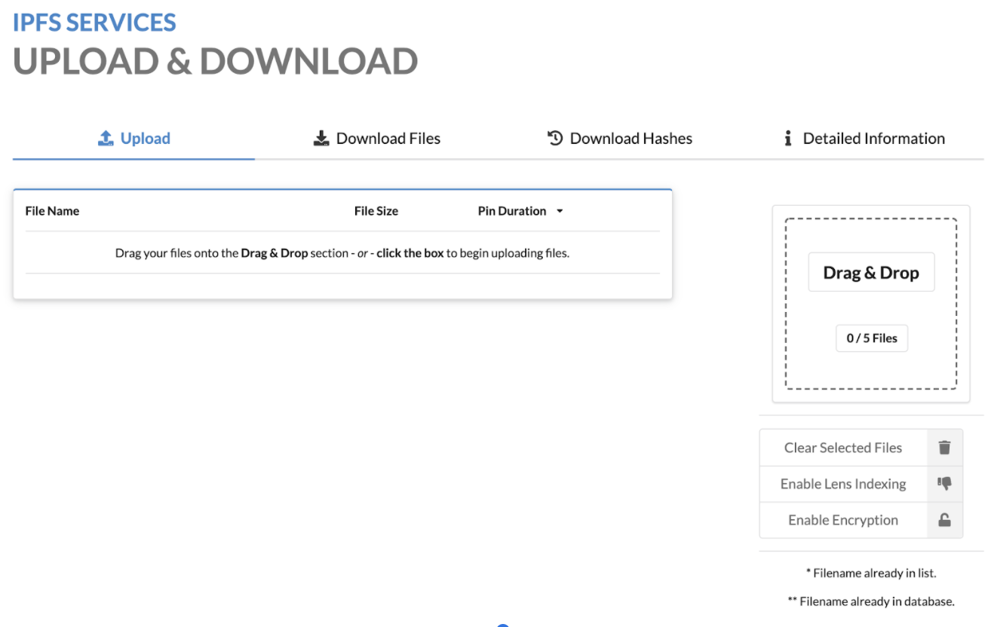
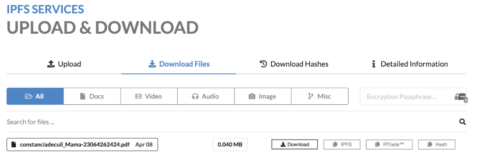
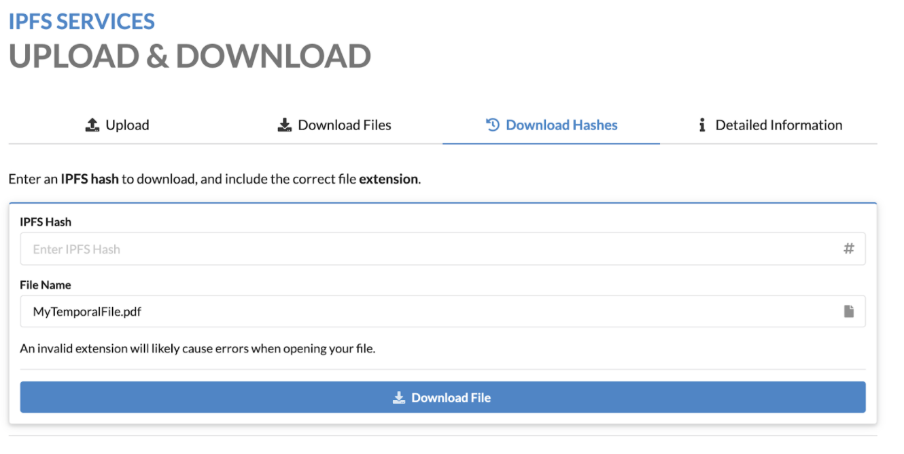
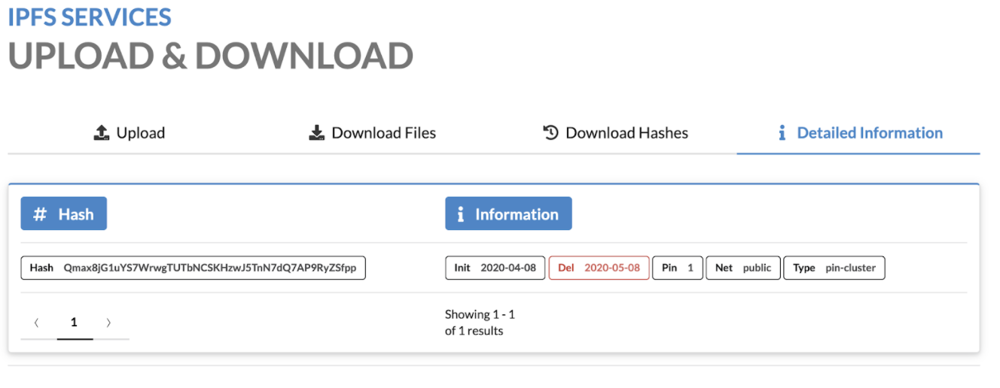

# RFP Proposal: `Simple Storage web application`

**Name of Project:** Simple Storage web application

**Link to RFP:** https://github.com/filecoin-project/devgrants/blob/master/rfps/new-wave-3-rfps.md#simple-storage-webapps

**RFP Category:** `app-dev`

**Proposer:** [@mgarciap](https://github.com/mgarciap)

**Do you agree to open source all work you do on behalf of this RFP and dual-license under MIT and APACHE2 licenses?:** Yes

# Project Description

The motivation behind the proposal is to deliver a positive change to the experience of end users and developers engaged in the Filecoin network. 

Today there isn't a simple and convenient “drag and drop” mechanism enabling end users to store/retrieve files.

This is a proposal for one of the high priority RFP ideas listed in [New RFP Ideas for Wave 3](https://github.com/filecoin-project/devgrants/blob/master/rfps/new-wave-3-rfps.md#filecoin-cid-checker-and-storage-oracle), the **Simple Storage webapp**:
> Single page apps that demonstrate using Filecoin to store and retrieve files. Example workflow: drag + drop a file, pay to store it, retrieve it. Show miner info, CIDs.
> One version could be eli5 (explain-it-like-I'm-5) to new users as a tutorial or tour.

We propose to create an end-to-end storage web application that could not only be used as a showcase for Filecoin but also as an open-source reference implementation and onboarding material with a strong focus on end-user UX and extensibility. It will consist of:
- Home page with an ‘Upload file’ call to action and the list of already stored files and their basic details. Each file will provide a link to their full detail and download action.
- Upload file flow: a wizard that will walk the user through the steps of choosing a file (simple button or drag and drop), setting up requirements, requesting the price,  processing payment and final uploading. After the process is finished a summary with CIDs and other storage details will be displayed.
- Download file flow.
- File details page with information such as miner, CIDs, etc.
- Onboarding help such as flow’s step-by-step descriptions and tooltips will be provided for new users (user can chose to hide them)

## Value for the community
- Provide a quick onboarding of new users by walking them through an end-to-end very simple storage web application.
- Serve as an open-source reference implementation for a light web storage application.
- Well documented and structured code to easily build and add new features such as file encryption, erasure coding to suggest an ideal number of redundant storage deals, resumable uploads, and more (scope for next optional phases).
- It hides all the complexity of the underlying technology (setting up, synchronizing and running a Filecoin node, CLIs, APIs, etc) lowering newcomers' friction.
- We will make active contributions in the form of PRs to the Javascript Lotus client as we find any issues or new features required and developed by our team.

Delivering this project will enable Protofire - 30+ engineers blockchain dev shop, with proven experience and reputation in the Ethereum ecosystem - to grow its skills around the Filecoin technology and to get to know the ecosystem so we could contribute more and help bootstrap developer adoption and network usage.

## Deliverables

- UI Mockups (Figma or Zeplin) and product specifications.
- Open source repositories dual-licensed under MIT and APACHE2 licenses for Frontend and Backend.
- Documentation.

## Development Roadmap

### Milestone 1 - Complete specifications
- Goals:
  - Create UI wireframes and mockups
  - Finalize specs and architecture
  - Validate specs with the Filecoin team
- Deliverables:
  - Application specs and architecture design
  - List of risks and mitigation plan
  - Refined development plan for upcoming milestones
  -Figma or Zeplin project with high-fidelity design mockups
- Outcomes:
  - Expectations, scope, effort and budget will be more clear for everybody
- Duration: 1 week
- Team: Part-time Go engineer, Part-time Tech Analyst, Full-time UI/UX designer and Part-time PM
- Budget: $5720

### Milestone 2 - Wallet integration
- Goals:
  - Start UI development
  - Integrate a Web Wallet integration ([Glif](https://github.com/openworklabs/filecoin-web-wallet))
  - Validate that the  required Wallet interactions work for checking balance and pay to miners.
- Deliverables:
  - Landing page UI
  - Initial Frontend wallet interaction tests.
- Outcomes:
  - We will validate that the proposed web wallet satisfies the needs. If not, further action will be proposed.
- Duration: 1 week
- Team: Full-time Frontend developer, Part-time Tech analyst, Full-time Go engineer and Part-time PM
- Budget: $7150

### Milestone 3 - Upload file flow
- Goals:
  - Backend development
  - Frontend development
  - Steps for the full cycle of making a deal
- Deliverables:
  - Backend and frontend code
- Outcomes:
  - As an end user I will be able to upload a file and it will be stored in Filecoin
- Duration: 1 week
- Team: Part-time Tech analyst, Full-time Go engineer, Full-time Frontend developer and Part-time PM
- Budget: $7150

### Milestone 4 - List files owned by the user
- Goals:
  - Implement file listing UIs
  - Implement backend and frontend logic
- Deliverables:
  - Backend code with new API endpoints
  - UI listing the files owned by the user along with their basic details such as CIDs and miner info.
- Outcomes:
  - After uploading a file to Filecoin in the previous Milestone, a user will be able to check it was properly uploaded by having a UI that will list it.
- Duration: 1  week
- Team: Full-time Go engineer, Full-time Frontend developer and Part-time PM
- Budget: $5720

### Milestone 5 - Download file flow
- Goals:
  - Implement UIs
  - Implement backend and frontend logic
- Deliverables:
  - New features in the backend code
  - New features in the frontend code to order download and then notify the user when it is ready for downloading.
- Outcomes:
  - A user will be able to choose a file from the list of owned files and initiate the downloading flow
  - A user will be notified when the file is ready to be downloaded
  - A user will be able to download the file to his/her local computer.
- Duration: 1 week
- Team: Full-time Go engineer and Full-time Frontend developer
- Budget: $5720

### Milestone 6 - QA and documentation
- Goals:
  - Complete automated tests and setup CI server
  - Fix bugs
  - Publish the code repository
  - Finish writing documentation
- Deliverables: 
  - The code is added to the GitHub repository designated by the Filecoin team
  - Detailed `Readme.md` explaining how to run, test and deploy the application as well as how to contribute
  - Instruction for end-users covering happy and not happy outcomes with troubleshooting details
- Outcomes:
  - All project deliverables are completed and added to the [Filecoin Shipyard](https://github.com/filecoin-shipyard) or any other organization indicated by Filecoin (website, documentation, codebase)
  - A tested version is running and connected to the Lotus network. Available for testing from the Filecoin team
- Duration: 1 week
- Team: Full-time QA engineer, Part-time Developer, Part-time Tech analyst and Part-time PM
- Budget: $ 4290

### Assumptions
- The user hosting the web application already has a synchronized Filecoin Node. The application will connect to this node.
- In order to allowing a user to pay for storage there are two requirements currently being built by other teams:
  - Wallet: it was mentioned by the Filecoin team that there is work-in-progress web wallet https://github.com/filecoin-project/docs/wiki#5-wallets (Glif). Also, there might be a beta MetaMask integration by mainnet launch.
  - Deals Order book integration, so this application can easily access the different miners prices and make a deal.
- This application depends on components that are under heavy development. We expect that it doesn’t impact on the estimates otherwise they will have to be revisited.
- The Filecoin team will provide a point of contact for technical questions so our development doesn’t get blocked when we have technical issues or questions impacting on delivery dates and team allocation costs.

If some of the requirements, such as the web wallet and the order book are not delivered by the time they are needed, we can either build them or work on work-arounds. This grant's scope of work will have to be updated by adding additional funding.

## Milestones & Funding

| Milestone No. | Milestone Description | Funding | Estimated Timeframe |
| --- | --- | --- | --- |
| 1 | Complete specifications | $5720 | 1 week|
| 2 | Wallet integration | $7150 | 1 week|
| 3 | Upload file flow | $7150 | 1 week|
| 4 | List files owned by the user | $5720 | 1 week|
| 5 | Download file flow | $5720 | 1 week|
| 6 | QA and documentation | $4290 | 1 week|

Project duration: 6 to 8 weeks
Total funding: $35750

## Potential future features

These are features that can leverage the work to be delivered and the team knowhow. 
To be scoped, estimated,  discussed and prioritized with the Filecoin team during and after project delivery.

| Feature / Milestone | Description |
| --- | --- |
| Be able to connect to a public hosted Filecoin node JSON RPC API endpoints exist | A user can upload/download files, pay with the FILs, and see the miner info without setting up and synchronizing an own Filecoin node |
| Encrypts and decrypts a file using basic PGP | [Keybase](https://keybase.io/encrypt) example or with MetaMask keys or other options | 
| Calculate recommended redundancy | Using a good erasure coding library (e.g. zfec) and can reconstruct data if a copy cannot be retrieved |
| Split large files for smaller pieces for a faster upload of big files| Files can be chunked and their parts are uploaded simultaneously |
| Managing multiple accounts | A user can have several sets of files synchronized with several FIL accounts | 
| Synchronize folders: local and Filecoin network | Option to download only new and changed files; delete orphaned files |
| Two-way files traffic | Parallel files Upload and Download |

## Maintenance and Upgrade Plans

Bugs and feature requests will be created in the github repository. Critical bugs will be fixed for a period of up to 2 months after delivery. After this period, a scope of work with the bugs and features can be created and applied for a grant.

# Team

## Contact Info

manuel@protofire.io

## Team Members

| Role | Team member | Role Description |
|---|---|---|
| Tech Analyst / PM | Vitaliy Chernov [LinkedIn](https://www.linkedin.com/in/vitaliy-chernov-45289a14) | Project Manager is responsible for: overseeing the design & development teams; creating specs; Lotus network data analysis and mapping; user stories/scenarios elaboration; drawing workflow diagrams |
| GoLang Developer | Alexander Kochetkov [LinkedIn](https://www.linkedin.com/in/alexander-kochetkov-6273599a/) | GoLang Developer is responsible for: Filecoin dev-node setup, synchronizing with the Lotus network; Defining methods of querying the data from the state; and Backend development |
| GoLang Developer/ AWS Certified Cloud Practitioner | Ilya Patotski [LinkedIn](https://www.linkedin.com/in/ilyapatotski) | GoLang Developer is responsible for: interaction between the backend and Lotus node; integration with a user FIL account; and Backend development |
| UI/UX designer | Gabriel Rodrigues [Github](https://github.com/gabitoesmiapodo) | UI Designer is responsible for the development of a Design System which includes UI and UX |
| Frontend Developer (React) | Mariano Aguero [Github](https://github.com/mariano-aguero) | FE developer is responsible for implementing visual elements that users see and interact with in a web application |
| QA engineer |Franco Venica [Github](https://github.com/francovenica) | QA engineer is responsible for ensuring the product is bug-free and meets client requirements |

## Team Website

http://protofire.io/

## Relevant Experience

Protofire is a team of engineers that helps providers of decentralized infrastructure, protocols and developer platforms to accelerate the growth of their ecosystems. 
Our goal is to invest in building expertise with Filecoin and become a long-term contributor and partner.
Our Relevant Expertise and GitHub links can be found in [this document](https://docs.google.com/document/d/1ql7UPQ4GxwSsR1-1Jm5rBVZwb6GWilfi63ze3QSMcGo/edit?usp=sharing). 

As for our commitment to the open-source ecosystem, Protofire develops and maintain the most popular Solidity linter: [Solhint](https://github.com/protofire/solhint) (currently funded by the Ethereum Foundation).

## Team code repositories

https://github.com/protofire

# Additional Information

## Sample Mockups

The following pictures are screenshots taken from https://play.temporal.cloud/uploads which can give an high level idea of the simplicity we are looking for for similar features provided by a solution that runs on top of IPFS.

---

---

---

