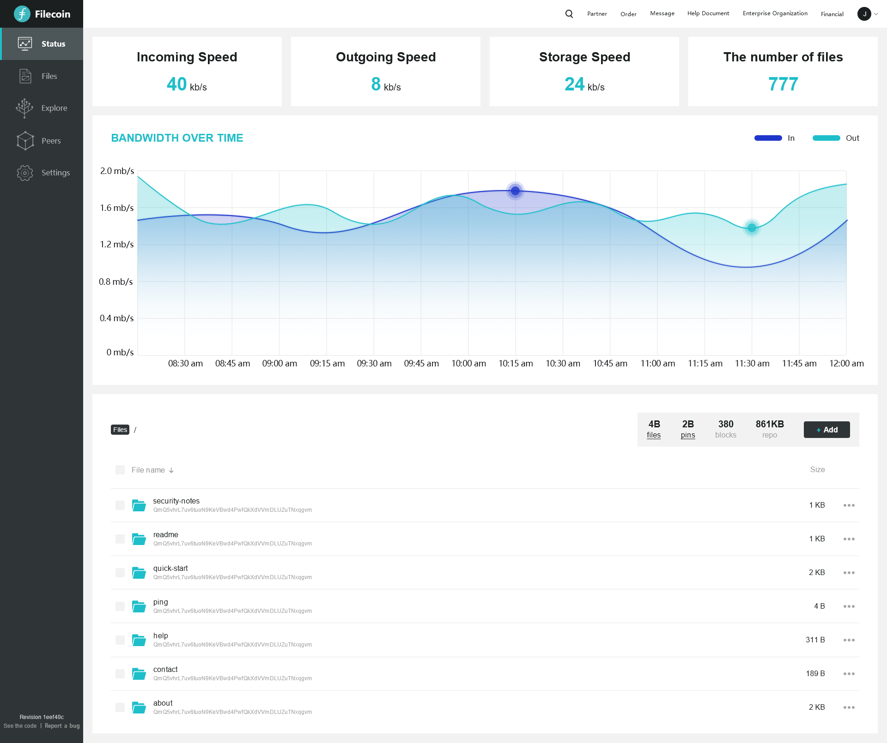

# RFP: `Storage Web Application Base on Filecoin POC`

**Name of Project:** `Storage Web Application Base on Filecoin POC`

**RFP Category:**  `app-dev`

**Proposer:** `maobisheng`

# Project Description

We plan to develop a storage web application to business based on the Filecoin network, which will enable users to 
upload, download and retrieve files more efficiently. After uploading the file, the user will get the hash value of the 
stored file. When the user needs to download the file, the hash value can be used to find the specified content and the 
stored information for that content such as location, cid, etc.

The project is currently in the design & research phase.

# Deliverables

A filecoin-based file upload, download, retrieval function Web portal

### Value

- Large capacity data storage space
- Stores and retrieves real user files / Provide efficient storage
- Secure and efficient data storage with high resource utilization

### Data to display

The following figure shows the main interface of the application:

## Team

IPFSUnion is a global IPFS & Filecoin service provider with professional technical background and complete supply chain 
located in Shanghai, China.

IPFSUnion is very interested in the landing application of Filecoin after the main network is launched, and has been 
working on applications that will help the community. With this official mention, we are pleased to be workind with the 
Filecoin team to implement a filecoin-based storage and retrieval platform.

## Milestones & Funding

**Total Funding Amount:** $10000 worth of FIL

**Milestones:** 

| Milestone No. | Milestone Description | Funding | Estimated Timeframe |
| --- | --- | --- | --- |
| 1 | UI design & Product design | 20% | 2 weeks |
| 2 | Development phase | 60% | 6 weeks |
| 3 | Testing phase & Release | 20% | 2 weeks |

At present, we are in the design & research phase, and we plan to release the test version witch could eli5 to new users
as a tutorial or tour before the main network is launched.
